#articles

# How Two Programmers Baked Bread

I've been a programmer for many years, and, strangely enough, I've been programming the whole time. And here's something interesting I've noticed: in code I wrote a month ago, I always want to tweak something a bit. In code from six months ago, I want to change a lot. And the code I wrote two or three years ago turns me into an emo kid: I just want to cry and die.

In this article, I'll describe two approaches. The first one makes the program architecture convoluted and maintenance unreasonably expensive, while the second follows the [KISS](https://en.wikipedia.org/wiki/KISS_principle) principle.

So, imagine two programmers. One of them is smart, has read tons of Habr articles, knows the [GoF catalog](https://en.wikipedia.org/wiki/Design_Patterns) by heart, and could recognize [Fowler](https://en.wikipedia.org/wiki/Martin_Fowler_(software_engineer)) in person. The other just keeps things simple. Let's call the first one Boris N., and the second one Marcus P. Naturally, the names are fictional, and any resemblance to real people or programmers is purely coincidental.

A project manager (if in your universe a [PM](https://en.wikipedia.org/wiki/Project_management) doesn't personally visit developers, call him a [BA](https://en.wikipedia.org/wiki/Business_analyst) or [lead](https://en.wikipedia.org/wiki/Lead_programmer) instead - it doesn't matter) comes to them and says:
— Guys, we need bread to be made.

Exactly like that - "made," with no details about how.

So, what do our programmers do?

## Iterations

### Boris

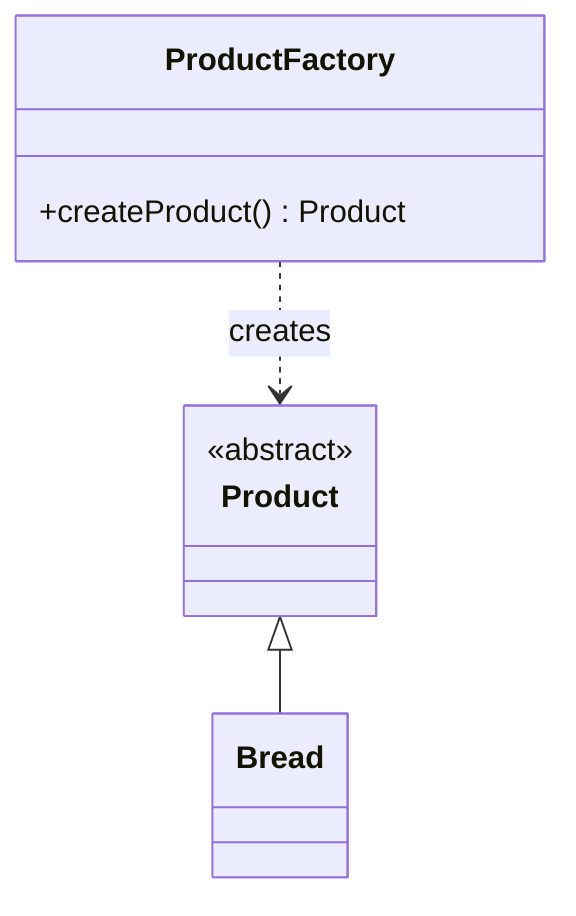

### Marcus

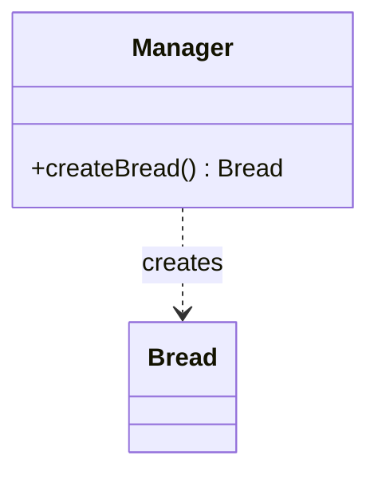

Boris creates his first abstraction - a `Product` class. From it, he inherits a `Bread` class, and instances are created by the factory method `createProduct()` of the `ProductFactory` class.

Marcus does almost the same. He creates a `Bread` class and a `Manager` class with a factory method `createBread()`.

So far, the difference is minimal. The project manager, thinking he understands the client better now, returns and says:
— We need the bread not just to be made, but baked in an oven.

### Boris

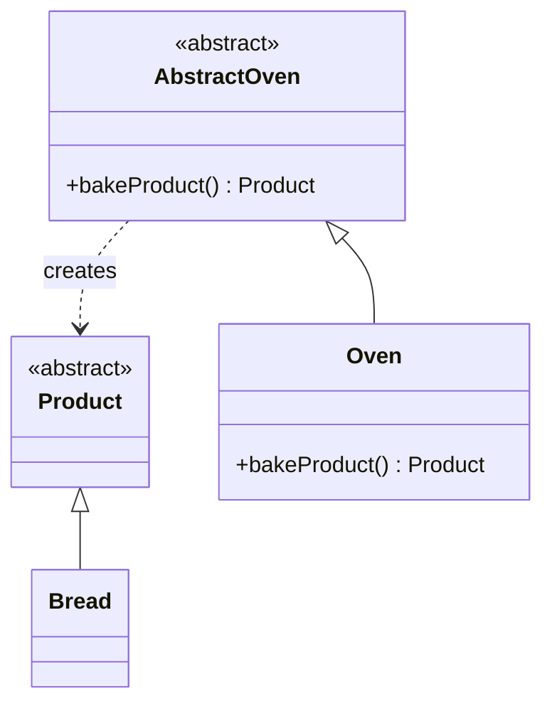

### Marcus

Boris renames `ProductFactory` to `Oven`, introduces `AbstractOven`, and renames `createProduct()` to `bakeProduct()`. Thus, Boris performs his first refactoring and applies the "[[Factory|Abstract Factory]]" pattern exactly as described in the literature. Well done, Boris.

Marcus, meanwhile, does nothing - he thinks everything works fine. Maybe he slightly adjusts `createBread()`.

The manager comes again:
— We need different types of ovens.

### Boris

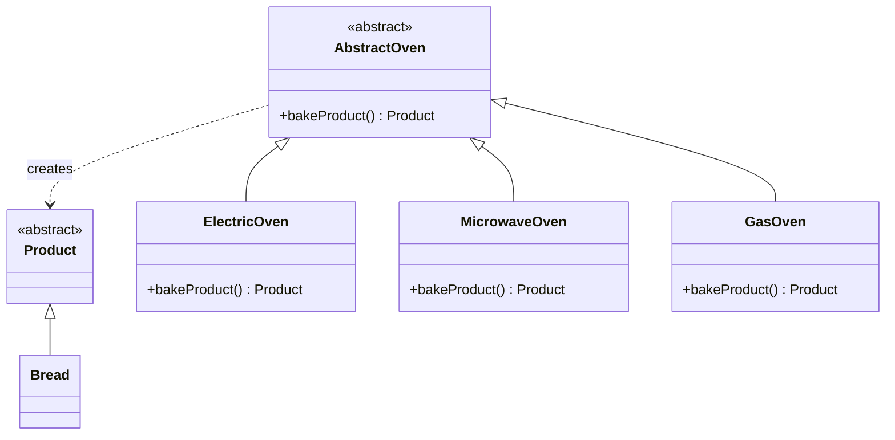

### Marcus

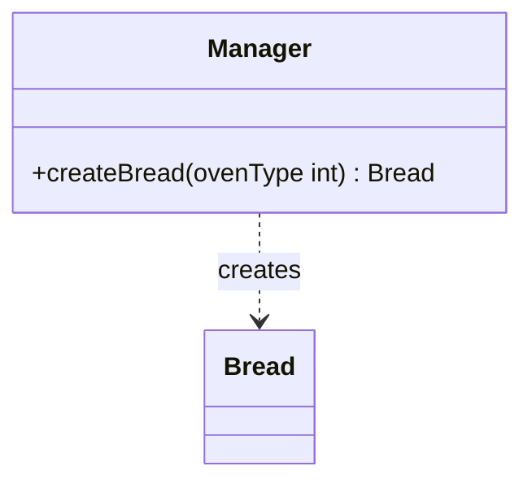

Boris, thrilled, creates `ElectricOven`, `MicrowaveOven`, and `GasOven` - all inheriting from `AbstractOven`. He deletes the old `Oven` class as redundant.

Marcus modifies his program too, adding an integer parameter `ovenType` to `createBread()`.

The manager returns:
— The gas oven shouldn't bake without gas.

### Boris

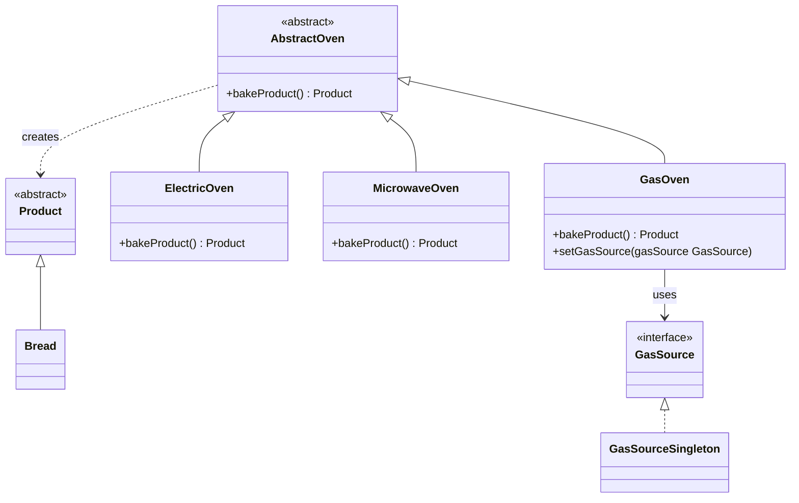

### Marcus

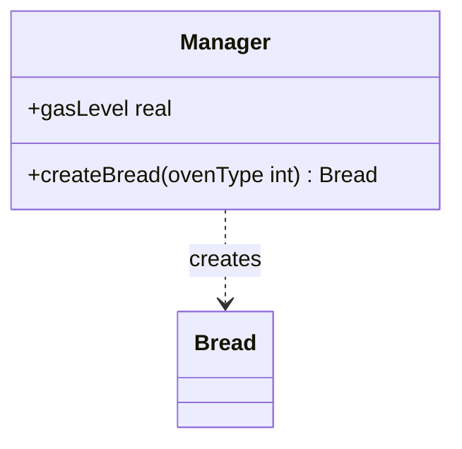

Boris decides that there can only be one gas source. Naturally, he implements a [Singleton](https://en.wikipedia.org/wiki/Singleton_pattern) - `GasSourceSingleton` - and injects it via the `GasSource` interface into `GasOven`.

Marcus simply adds a `gasLevel` field to the `Manager` class and adjusts the method logic.

The manager returns again:
— We need the ovens to bake pies (with meat and with cabbage) and cakes too.

### Boris

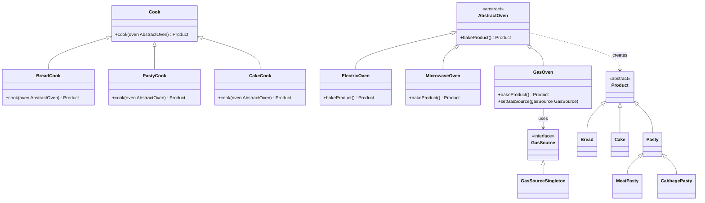

### Marcus

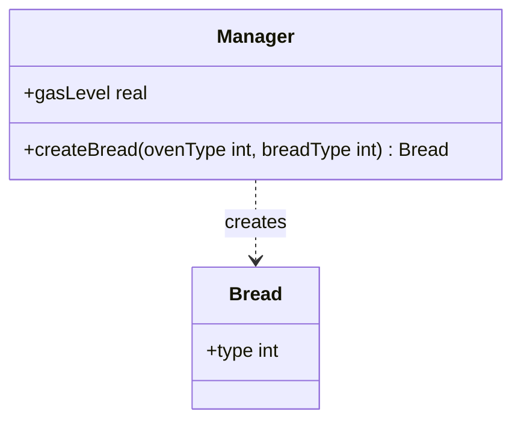

Boris can't stop himself now. How will the oven know what to bake? Obviously, it needs a cook. He creates a `Cook` class with a `cook(oven: AbstractOven): Product` method. Then he makes subclasses `BreadCook`, `PastyCook`, and `CakeCook`. He also expands `Product` into `Cake` and `Pasty`, and from `Pasty` derives `MeatPasty` and `CabbagePasty`.

Marcus just adds another integer parameter, `breadType`.

Next:
— Bread, pies, and cakes should each have their own recipes.

### Boris

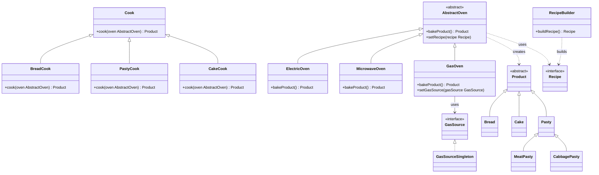

### Marcus

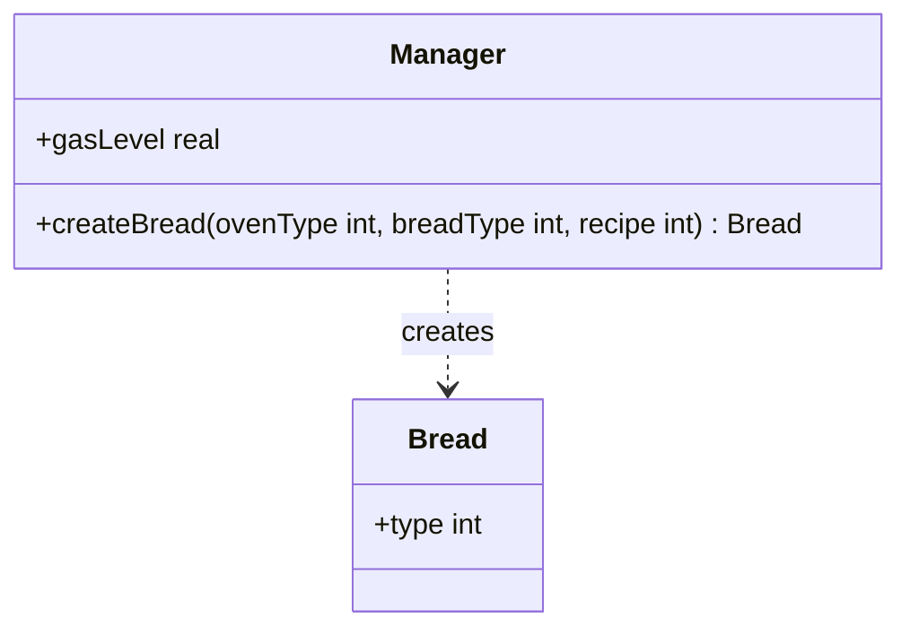

Boris remembers the [Builder](https://en.wikipedia.org/wiki/Builder_pattern) pattern and creates `Recipe` and `RecipeBuilder`. The recipe is injected into the oven through a setter `setRecipe(recipe: Recipe)`.

Marcus, unsurprisingly, adds another integer parameter `recipe`.

Finally, the manager meets the client for the first time and realizes what the oven was really for. He returns:
— The oven must also be able to fire bricks.

### Boris

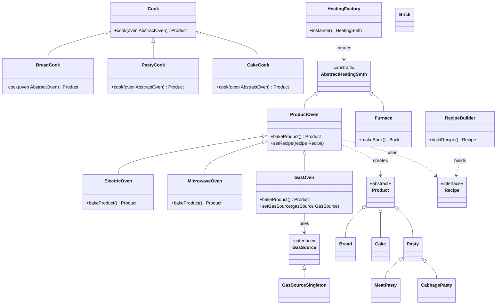

### Marcus

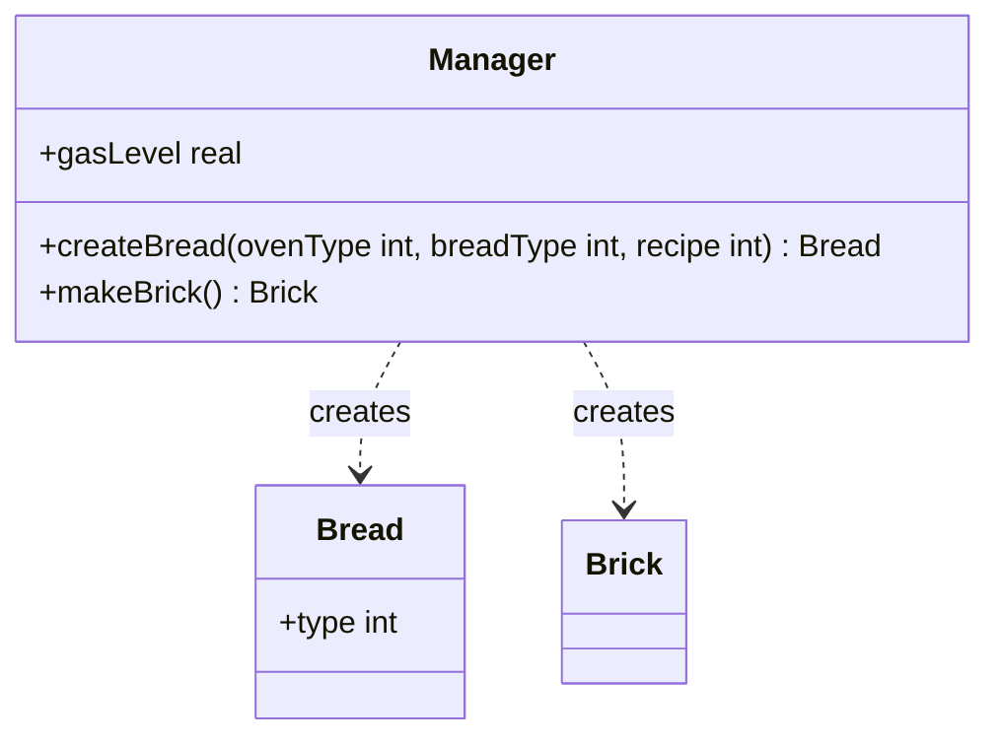

Boris, exhausted, creates `AbstractHeatingSmth`, `HeatingFactory`, `ProductOven`, and `Furnace`, with a factory method `makeBrick()`. It doesn't work. The reader is invited to find the architectural flaw.

Marcus, meanwhile, adds a third class `Brick` and a `makeBrick()` method.

Sure, Marcus's `createBread()` is a mess, but he could clean it up with the [Template Method](https://en.wikipedia.org/wiki/Template_method_pattern) pattern. Boris, meanwhile, is lost in his own abstractions.

## Conclusion

> [!warning]
> Boris's architecture grew from speculative generalization — adding abstractions for requirements that hadn't arrived yet. Each new abstraction increased the cost of every future change, even simple ones.

Boris's approach is good because almost every part of the system can be isolated and tested. But it takes an obscene amount of time to build, and every change triggers a cascade of edits. Trying to make architecture flexible by anticipating future requirements usually fails - the system bends in the wrong place.

Marcus's approach doesn't allow easy modular testing but delivers results much faster and with less pain. It's that "fast start" that every startup dreams about. And, surprisingly, such code is often easier to understand - simply because it's simpler.

> [!tip]
> The takeaway is not "never use patterns" — it is "don't introduce abstractions until the code demands them." Patterns are refactoring tools, not starting points.