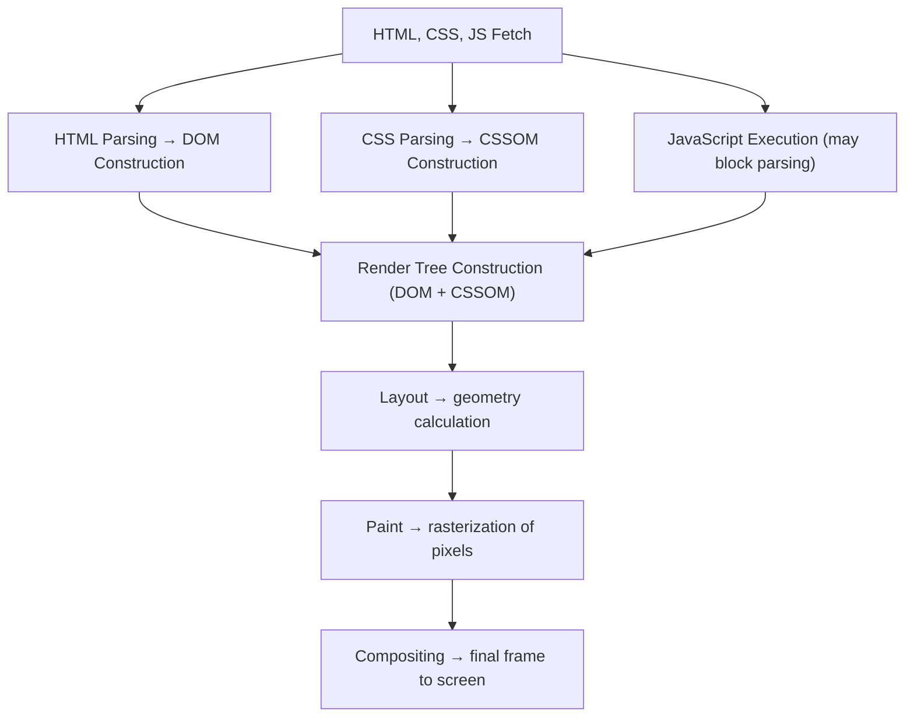

#browser
# Situating the Critical Rendering Path

The **Critical Rendering Path (CRP)** defines the minimal sequence of operations that convert HTML, CSS, and JavaScript into pixels on the screen.  
Understanding and optimizing this path directly improves **First Contentful Paint (FCP)** and **Largest Contentful Paint (LCP)** — key metrics of perceived performance.[^47]
## Diagram

This diagram illustrates how the browser transforms source files into a rendered frame.  
Each phase depends on the completion of the previous one; optimizing early stages has a cascading effect on total render time.

## Why It Matters

Every additional millisecond spent in the CRP delays visual feedback to the user.  
A shorter path means earlier content visibility, faster interactivity, and improved perceived speed — especially on mobile and low-end devices.

## Relationship to the Rendering Pipeline

The CRP maps directly onto the browser's [[The Cross-Engine Browser Rendering Pipeline|rendering pipeline]]:

1. **Fetch** – download HTML, CSS, and JS.
2. **Parse** – build the [[DOM]] and [[CSSOM]].
3. **Render Tree** – merge structure and styles into visual nodes.
4. **Layout** – compute geometry for each node.
5. **Paint** – rasterize layers into pixels.
6. **Composite** – assemble layers for the GPU to display.[^16][^19][^21][^24][^47]

Although each engine (Blink, WebKit, Gecko) implements optimizations differently, all adhere to the same dependency order.

## Optimization Levers

To minimize CRP latency:

- Remove **main-thread blockers** (synchronous scripts, render-blocking CSS).
- **Preload critical assets** (`<link rel="preload">`, `<script defer>`).
- Inline or extract **critical CSS** for above-the-fold content.
- Use **skeleton UIs** or placeholder layouts to mask unavoidable delays.[^28][^47][^48]

> [!tip]
> The single highest-impact optimization is usually eliminating render-blocking CSS and synchronous scripts from the `<head>`. Everything downstream in the pipeline waits on these.

These strategies reduce dependency depth and keep layout and paint operations minimal.

## Cross-Engine Nuances

- **Blink** and **WebKit** offload parsing and rasterization to background threads.
- **Gecko's WebRender** performs GPU rasterization earlier in the pipeline.
- All engines maintain the same CRP checkpoints but differ in **task scheduling** and **preload heuristics**.[^24][^40][^41][^47]

## DevTools Verification

Use performance tools to observe CRP activity:

- **Chrome DevTools** → Performance panel
- **Safari** → Timeline
- **Firefox** → Profiler

Look for **Parse HTML**, **Recalculate Style**, **Layout**, and **Paint** events.  
Their durations reveal whether optimizations actually shorten the Critical Rendering Path.[^38][^47]

> [!info]
> The CRP is not a fixed cost — it varies per page load depending on cache state, network conditions, and resource ordering. Always measure on real devices, not just fast development machines.