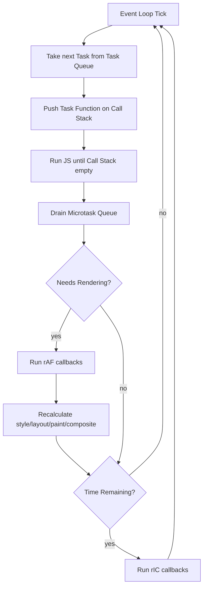

#browser
# The Browser Event Loop Scheduling
## Executive Summary

The browser event loop orchestrates tasks, microtasks, animation frames, and idle callbacks to keep pages interactive and paint frames at 60fps. It picks a task (script, network, DOM event) to run, drains microtasks for spec-mandated invariants, then decides whether to update rendering and schedule `requestAnimationFrame` handlers before painting; any leftover budget is offered to `requestIdleCallback`, ensuring long work yields to input while still allowing background bookkeeping.[^1][^2][^5][^6][^7][^8]
## Scope

- Focus on the default window event loop for top-level browsing contexts in Blink, WebKit, and Gecko; worker loops and Node.js semantics are out of scope.[^1][^4]
- Covers scheduling of tasks, microtasks, `requestAnimationFrame`, and `requestIdleCallback`, plus the render update checkpoint; timers clamped by background tabs and battery savers are noted only when they affect ordering.[^1][^5][^6]
- Surfaces developer-facing hooks--Promises, timers, animation and idle APIs--and how they interact with layout/paint work; discussions of user-land scheduler polyfills remain qualitative.[^2][^3][^7]
## Event Loop Cycle

- #### Spec checkpoints
Each iteration follows the HTML Standard: select a task from the task queue, execute it, drain the microtask queue, optionally update rendering, then service idle callbacks before reiterating.[^1][^7][^8]
- #### Rendering gate
The `update the rendering` step runs only when the user agent judges the frame ready (for example animation frame due, visual updates pending); otherwise the loop jumps straight to idle callbacks or the next task.[^7][^8]
- #### Timing budget
At 60 Hz the loop has ~16 ms per frame; blocking the loop with synchronous work pushes the next rendering opportunity and causes jank or input latency.[^5][^6][^8]

> [!warning]
> The 16 ms budget includes browser overhead (style, layout, paint), not just your JavaScript. In practice, scripts should target under 10 ms per task to leave room for rendering work.

## Task vs Microtask Queues

- #### What counts as a task
Timers, network events, DOM events, history navigation, and postMessage callbacks enqueue tasks; the event loop services them one at a time, guaranteeing user input and timers can interleave with script execution.[^1][^3]
- #### Microtask invariants
Promises, `queueMicrotask`, and mutation observers populate the microtask queue, which must be exhausted before the loop can render or process another task, preserving the spec's consistency guarantees for promises.[^4][^7]
- #### Performance risks
Runaway microtasks prevent rendering progress because each microtask can schedule more microtasks, keeping the queue non-empty and starving the rendering and input phases.[^2][^4]

> [!danger]
> A `Promise.resolve()` loop that recursively enqueues microtasks will freeze the page indefinitely — the browser cannot render or process input until the microtask queue is fully drained.

- #### Practical guidance
Use microtasks for brief state reconciliation (for example bridging resolved promise data to framework state); reserve heavy work or I/O for tasks so users regain control between chunks.[^2][^3]
## Animation Frame Scheduling

- #### rAF semantics
`requestAnimationFrame` callbacks run after microtasks but immediately before rendering, giving scripts a stable DOM/CSS snapshot to prepare visual updates in sync with the compositor.[^5][^7]
- #### Refresh-driven throttling
Browsers align rAF with the display's refresh rate; hidden tabs clamp or pause callbacks to avoid wasted work and battery drain.[^5]
- #### Layout coordination
Measure DOM (for example `getBoundingClientRect`) and apply visual updates inside rAF to avoid forced synchronous layouts mid-task.[^5][^8]

> [!tip]
> The read-then-write pattern inside `requestAnimationFrame` is the key to avoiding layout thrashing: read geometry first, then batch all DOM writes afterward.

- #### Cross-engine notes
Blink and WebKit run rAF callbacks on the main thread; Gecko proxies them through the refresh driver but still guarantees execution right before paint.[^5][^8]

> "Animation frame callbacks must be run before updating the rendering." -- WHATWG HTML, Animation frames[^7]
## Idle Callbacks and Cooperative Yielding

- #### Idle window
`requestIdleCallback` handlers run only if the loop has spare time after rendering; the provided deadline reports the milliseconds remaining before the browser needs to service the next frame or task.[^6]
- #### Long tasks strategy
Break background work into chunks, check `deadline.timeRemaining()` (or `deadline.didTimeout` for queued work that aged out), and reschedule with another idle request when time runs out.[^6]
- #### Input priority
Any pending input task preempts idle callbacks, so do not rely on idle time for latency-sensitive work like form validation or autocomplete.[^1][^6]
- #### Fallbacks
Use a timer-based fallback when rIC is unavailable (Safari prior to 16.4) but gate heavy work so it still yields frequently.[^6]
## Render Ordering and Visual Stability

- #### Rendering checkpoint
During `update the rendering`, the user agent runs style recalculation, layout, paint, and compositing work needed for the next frame (the [[Critical Rendering Path]]); this step occurs after rAF and before idle callbacks.[^7][^8]
- #### Forced reflow
Synchronous DOM reads after writes inside tasks trigger immediate style/layout flushes, skipping the usual render checkpoint and shrinking the frame budget.[^5][^8]
- #### Long animations
Use CSS animations or rAF-driven state machines to stay inside frame budgets; avoid doing large microtask batches that delay rAF and cause dropped frames.[^2][^5]
- #### Diagnostics
Chrome's Performance panel, Firefox Performance, and Safari Timeline label tasks, microtasks, rAF, and rendering phases, so use them to confirm scheduling assumptions.[^5][^9]
## Tooling and Verification

- #### DevTools tracing
Record a performance trace and inspect Main Thread tracks: look for Task, Run Microtasks, Animation Frame Fired, and Paint events to validate ordering.[^5][^9]
- #### Long Task API
Monitor `PerformanceObserver` for `longtask` entries to detect work exceeding 50 ms, and pair with `scheduler.postTask` (experimental) for finer priorities when available.[^3][^9]
- #### Testing strategy
Simulate slow devices with throttling, ensure microtask-driven state (for example resolved promises) does not starve rAF, and confirm idle callbacks reschedule when deadlines expire.[^5][^6]
- #### Operational guardrails
Set performance budgets in CI for script execution time and frame throughput to catch regressions in scheduling-sensitive code.[^9]

[^1]: Anne van Kesteren et al., HTML Living Standard, Event loops, https://html.spec.whatwg.org/multipage/webappapis.html#event-loops, accessed 2024-05-10.
[^2]: MDN Web Docs, Concurrency model and the event loop, https://developer.mozilla.org/docs/Web/JavaScript/EventLoop, accessed 2024-05-10.
[^3]: Anne van Kesteren et al., HTML Living Standard, Tasks, https://html.spec.whatwg.org/multipage/webappapis.html#tasks, accessed 2024-05-10.
[^4]: WHATWG HTML Standard, Microtask queue, https://html.spec.whatwg.org/multipage/webappapis.html#microtask-queue, accessed 2024-05-10.
[^5]: MDN Web Docs, Window.requestAnimationFrame(), https://developer.mozilla.org/docs/Web/API/window/requestAnimationFrame, accessed 2024-05-10.
[^6]: MDN Web Docs, Window.requestIdleCallback(), https://developer.mozilla.org/docs/Web/API/Window/requestIdleCallback, accessed 2024-05-10.
[^7]: WHATWG HTML Standard, Animation frames, https://html.spec.whatwg.org/multipage/webappapis.html#animation-frames, accessed 2024-05-10.
[^8]: WHATWG HTML Standard, Update the rendering, https://html.spec.whatwg.org/multipage/webappapis.html#update-the-rendering, accessed 2024-05-10.
[^9]: Chrome Developers, Rendering Performance, https://developer.chrome.com/docs/lighthouse/performance/rendering-performance/, accessed 2024-05-10.
