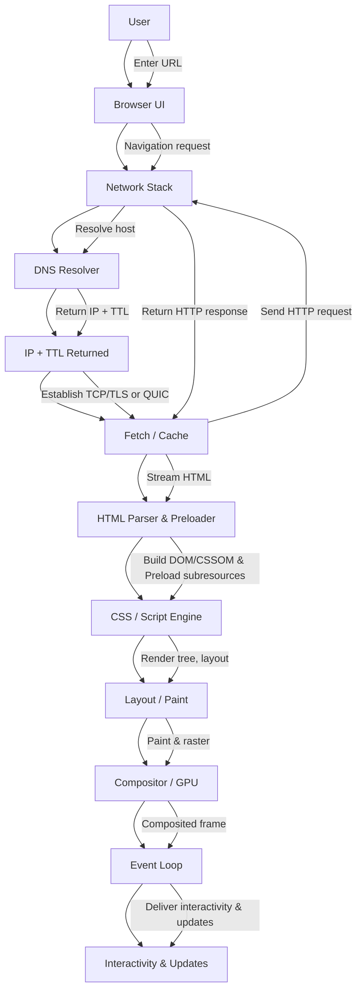

#browser
# The Cross-Engine Browser Rendering Pipeline
## Executive Summary

Desktop-class browsers fetch a URL, build the Document Object Model ([[DOM]]) tree that represents HTML nodes, compute the CSS Object Model ([[CSSOM]]) for styles, assemble a render tree, run layout to assign geometry, paint into draw commands, rasterize tiles on the GPU, and composite layers before the event loop lets scripts respond to input, producing a fully rendered and interactive page.[^16][^19][^20][^21][^23][^24][^25]
## Scope

- Focus on desktop-class Blink (Chrome/Edge), WebKit (Safari), and Gecko (Firefox) engines; engine-specific behavior is called out explicitly where relevant.[^39][^40][^41]
- HTTP/1.1 over TCP + TLS 1.3 is the baseline, with HTTP/2 and HTTP/3 (QUIC) outlined for multiplexing, header compression, and 0-RTT considerations.[^5][^7][^8][^9][^10][^11]
## High Level End-to-End Flow

## Deep Dive

### URL Processing & Navigation Start

- #### What happens
The browser UI parses the typed string into a Uniform Resource Identifier (URI), derives the target origin, referrer policy, and navigation type before invoking the HTML navigation algorithm.[^1][^2]

- #### Key algorithms
The navigation algorithm sequences history entry updates, process selection, and the creation of a new document or document reuse when allowed.[^2]

- #### Performance implications
Accurate origin extraction enables connection reuse and early process assignment, avoiding costly cross-origin swaps once loading begins.[^2]

- #### Security & privacy
Referrer policy and origin checks enforce same-origin policy boundaries during navigation, protecting against inappropriate credential reuse.[^2]

- #### Cross-engine nuances
Blink, WebKit, and Gecko implement the same navigation algorithm but differ in process models; all follow the spec-mandated steps to start fetching.[^2]

- #### DevTools verification
Use the Network panel's Initiator and Timing columns to confirm navigation start and redirect handling for the main document request.[^38]

> "To navigate, the user agent must run the following steps."  WHATWG HTML 7.1[^2]
> Paraphrase: Navigation follows a prescribed sequence that coordinates history, process selection, and document loading.

### DNS Resolution

- #### What happens
The browser asks the operating system's stub resolver for the hostname; on a cache miss, the stub forwards the query to its configured recursive resolver—typically provided by the network via DHCP, but possibly a VPN, enterprise, or DNS-over-HTTPS provider—to obtain answers and caching directives.[^3][^4][^49]

- #### Key algorithms
Recursive resolvers follow referrals from root to top-level-domain and authoritative name servers, caching the resulting RRset and TTL so subsequent lookups can reuse the mapping locally.[^3][^4][^49]

- #### Where the resolver comes from
Network configuration (DHCP, static settings, VPN profiles) publishes resolver IPs; browsers may override with DoH templates, yet all parties must respect RFC-defined TTLs, negative caching rules, and SERVFAIL semantics.[^4][^42][^49]

- #### Performance implications
Cache hits eliminate network latency; TTL expirations trigger fresh recursion that adds navigation time, while speculative DNS prefetch keeps critical hostnames warm.[^4][^28][^47]

- #### Security & privacy
Encrypting the hop between stub and recursive resolver with DoH or DoT reduces hostname leakage, but trust still rests with the selected resolver operator.[^4][^42][^49]

- #### Asset hostnames
Each subresource (scripts, fonts, images, third-party embeds) may sit on distinct hostnames; preload, preconnect, and early hints mitigate CRP stalls by resolving and connecting to these origins in advance.[^28][^47][^48]

- #### Cross-engine nuances
All engine stacks delegate to OS or internal resolvers but must respect shared caching and TTL semantics to avoid divergent behaviors across navigations.[^3][^4]

- #### DevTools verification
The Network panel's Timing view shows DNS lookup durations for each request—0 ms indicates a cache hit, while longer intervals highlight resolver round-trips.[^38]

> "The domain name space is a tree structure."  RFC 1034 2.1[^3]
> Paraphrase: DNS lookups traverse a hierarchical namespace, enabling cached delegation at each node.

### Connection Setup

- #### What happens
The browser opens or reuses a TCP or QUIC transport connection, negotiating TLS 1.3 for confidentiality and integrity before HTTP semantics flow.[^5][^11]

- #### Key algorithms
TCP slow start, TLS 1.3 key schedule, and QUIC connection IDs coordinate handshakes and packet protection.[^5][^11]

- #### Performance implications
TLS 1.3's 1-RTT handshake and QUIC's zero-RTT resume reduce time to first byte when connections are reused safely.[^5][^11]

- #### Security & privacy
TLS authenticates servers, encrypts requests, and prevents passive observers from seeing URLs beyond hostnames.[^5]

- #### Cross-engine nuances
Blink, WebKit, and Gecko all rely on platform TLS stacks but implement the same protocol negotiation defined in TLS 1.3 and QUIC.[^5][^11]

- #### DevTools verification
Inspect the Network panel's Timing > Connection and SSL columns to measure transport handshake costs per request.[^38]

> "The TLS 1.3 handshake requires only one round-trip in the common case."  RFC 8446 1[^5]
> Paraphrase: TLS 1.3 shortens connection setup latency compared with earlier versions.

### HTTP/1.1 over TCP + TLS 1.3

- #### What happens
After TLS, the client sends an HTTP/1.1 request line, headers, and optional body, receiving a status line, headers, and entity body in response.[^6][^7]

- #### Key algorithms
Persistent connections and pipelining rules govern how multiple requests share the same TCP connection sequentially.[^7]

- #### Performance implications
Head-of-line blocking within a single TCP stream limits concurrency, making resource waterfalls sensitive to blocking requests.[^7]

- #### Security & privacy
Headers carry cookies and credentials; TLS protects them in transit but applications must scope them carefully.[^5][^13][^43]

- #### Cross-engine nuances
All engines use the same HTTP/1.1 semantics but vary in heuristics for connection reuse and parallelism; the protocol constraints are uniform.[^7]

- #### DevTools verification
The Network panel waterfall reveals serialized HTTP/1.1 fetches, with Connection ID reused across requests showing persistent sockets.[^38]

> "HTTP/1.1 defaults to persistent connections."  RFC 9112 9.1[^7]
> Paraphrase: HTTP/1.1 reuses TCP sockets unless headers explicitly close them, enabling keep-alive semantics.

### HTTP/2 Multiplexing and HPACK/QPACK Basics

- #### What happens
HTTP/2 frames multiple bidirectional streams over one TCP connection, allowing concurrent request-response exchanges.[^8]

- #### Key algorithms
Stream prioritization, flow control windows, and HPACK header compression reduce redundant metadata on the wire.[^8][^9]

- #### Performance implications
Multiplexing mitigates head-of-line blocking at the HTTP layer, but the shared TCP connection still suffers if lost packets stall all streams.[^8]

- #### Security & privacy
Header compression contexts are specific to each connection, avoiding cross-origin leakage yet requiring protection against compression side channels.[^9]

- #### Cross-engine nuances
Implementations may schedule priorities differently but must obey the HTTP/2 stream and priority rules defined in the specification.[^8][^9]

- #### DevTools verification
Enable the Protocol column to confirm h2 usage and inspect multiplexed streams sharing Stream IDs in the Network panel.[^38]

> "HTTP/2 allows multiple concurrent exchanges on a connection by using streams."  RFC 9113 5.1[^8]
> Paraphrase: HTTP/2 multiplexes logical streams so the browser can fetch several resources simultaneously over one socket.

### HTTP/3 over QUIC (0-RTT Caveats)

- #### What happens
HTTP/3 maps requests to QUIC streams running over UDP, inheriting QUIC's connection migration and per-stream flow control.[^10][^11]

- #### Key algorithms
QPACK header compression manages dynamic tables without head-of-line blocking, while 0-RTT data is gated by replay safety checks.[^10][^11]

- #### Performance implications
Eliminating TCP head-of-line blocking improves resilience to packet loss, but 0-RTT data must be idempotent to avoid replay risks.[^10][^11]

- #### Security & privacy
QUIC integrates TLS 1.3 for encryption and authenticates 0-RTT resumption tickets, constraining exposure.[^11]

- #### Cross-engine nuances
Implementations may use different QUIC libraries but must obey the same HTTP/3 stream, QPACK, and 0-RTT rules defined in the RFCs.[^10][^11]

- #### DevTools verification
Capture a performance trace or use `chrome://net-export` to confirm h3 usage since the standard Network panel currently labels HTTP/3 as h3.[^38]

> "HTTP/3 uses QUIC to transport HTTP semantics over UDP."  RFC 9114 1[^10]
> Paraphrase: HTTP/3 replaces TCP with QUIC while keeping the same HTTP message semantics.

### Request Dispatch (Methods, Headers, Cookies, CORS)

- #### What happens
The fetch layer constructs a Request object with method, target URL, header list, credentials mode, and body, then applies [[CORS]] policy when crossing origins.[^6][^12]

- #### Key algorithms
The Fetch algorithm issues preflight requests when required and merges credentialed headers like cookies and authorization data according to policy.[^12][^13][^43]

- #### Performance implications
Avoiding unnecessary preflights and limiting cookies reduces request latency and payload size, especially for cross-origin APIs.[^12][^13][^43]

- #### Security & privacy
Cookies scope via attributes such as `Domain`, `Path`, `Secure`, and `SameSite`, constraining where credentials are sent.[^13][^43]

- #### Cross-engine nuances
Engines share the Fetch standard implementation model even if internal code differs; deviations must still honor method normalization and header rules.[^12]

- #### DevTools verification
Inspect the Request Headers pane to confirm method, credentials, preflight requests, and cookie inclusion on each fetch.[^38]

> "A request has an associated method, header list, body, and other metadata."  WHATWG Fetch 2[^12]
> Paraphrase: Fetch formalizes HTTP requests as structured objects that drive networking, CORS, and credentials behavior.

### Response Handling (Status, Content-Type, Caching)

- #### What happens
Servers reply with a status code, headers, and body that the browser interprets using MIME type sniffing, content coding, and caching metadata.[^6][^14][^30]

- #### Key algorithms
MIME sniffing determines the computed media type when headers are ambiguous; cache validators govern reuse.[^14][^30]

- #### Performance implications
Correct `Content-Type`, compression, and cache directives reduce parse ambiguity and avoid refetching unchanged assets.[^14][^30]

- #### Security & privacy
MIME sniffing guards against content-type confusion attacks; caching rules enforce revalidation to avoid serving stale or unintended content.[^14][^30]

- #### Cross-engine nuances
While sniffing heuristics are shared by spec, engines may supplement with blocklists; they must still follow the normative algorithm.[^14]

- #### DevTools verification
Use the Response Headers and Preview tabs to confirm MIME type detection, compression, and cache hit/miss status.[^38]

> "To determine a resource's computed MIME type, run the sniffing algorithm."  MIME Sniffing Standard 2[^14]
> Paraphrase: Browsers follow a standard algorithm when headers are insufficient to identify the response media type.

### HTML Parsing (Tokenization & Tree Construction)

- #### What happens
The HTML parser consumes the response stream, tokenizes bytes into tokens, and drives tree construction to build [[DOM]] nodes in insertion modes.[^15][^16]

- #### Key algorithms
The tokenization state machine and tree builder handle insertion modes (initial, before html, in head, etc.), managing foster parenting and script pauses.[^15]

- #### Performance implications
Streaming parsers start [[DOM]] construction before the entire response arrives, but blocking scripts can pause tokenization.[^15][^18]

> [!warning]
> A single synchronous `<script>` tag without `defer` or `async` halts the entire HTML parser. Every DOM node after it waits until the script is fetched, compiled, and executed.

- #### Security & privacy
Strict parsing prevents malformed markup from triggering script execution in unintended contexts.[^15]

- #### Cross-engine nuances
All engines implement the shared state machine; error-handling quirks are standardized to ensure cross-browser compatibility.[^15]

- #### DevTools verification
In the Sources panel, watch the [[DOM]] tree update incrementally and observe parser pauses in the Performance panel's Main thread track.[^38]

> "The input stream is tokenized by the tokenization stage, which emits tokens for the tree construction stage."  WHATWG HTML 8.2.4[^15]
> Paraphrase: HTML parsing is a two-stage pipeline of tokenization followed by tree construction.

### Document & DOM Creation

- #### What happens
Tree construction instantiates Document, Element, and Text nodes, forming the [[DOM]], a platform-neutral API surface for scripts and layout.[^16]

- #### Key algorithms
Node insertion, attribute setting, and mutation observers follow the [[DOM]] Standard's tree mutation procedures.[^16]

- #### Performance implications
Minimizing sync [[DOM]] mutations during parsing reduces reflow/relayout churn and garbage-collection pressure.[^16][^25]

- #### Security & privacy
[[DOM]] APIs enforce same-origin restrictions on script-visible interfaces, preventing unauthorized cross-document access.[^16]

- #### Cross-engine nuances
Each engine exposes the same Web IDL interfaces; backing implementations vary but must pass [[DOM]] conformance tests.[^16]

- #### DevTools verification
Use the Elements panel to inspect the live [[DOM]] tree and Mutation observer logs when scripts alter structure.[^38]

> "The DOM Standard is a platform- and language-neutral interface."  DOM Standard 1[^16]
> Paraphrase: DOM defines interoperable object interfaces independent of engine implementation details.

### Preload Scanner (Speculative Fetch)

- #### What happens
While the main parser runs, a speculative preloader scans upcoming markup to enqueue high-priority subresource requests (CSS, scripts, fonts).[^17][^39][^40]

- #### Key algorithms
The speculative parser tokenizes ahead without mutating the [[DOM]], scheduling fetches that obey prioritization rules.[^17][^39]

- #### Performance implications
Early discovery of critical resources shortens the critical rendering path by overlapping network latency with parsing.[^17][^39][^40]

- #### Security & privacy
Preloaded requests still respect [[CORS]], mixed content, and CSP checks before execution.[^14][^35]

- #### Cross-engine nuances
Blink's preload scanner, WebKit's speculative loader, and Gecko's loaders follow the same speculative fetching goals while using different plumbing.[^39][^40][^41]

- #### DevTools verification
Track Initiator chains in the Network panel to see speculative fetches initiated before the parser reaches the element.[^38]

> "User agents may run a speculative HTML parser to discover resources ahead of time."  WHATWG HTML 8.2.3.1[^17]
> Paraphrase: Browsers can scan future markup to request subresources before the main parser arrives at them.

### Scripts: Blocking, Defer, and Async

- #### What happens
Parser-inserted scripts without `async` or `defer` pause parsing, whereas `async` executes when fetched and `defer` waits until after parsing completes.[^15][^18]

- #### Key algorithms
The script execution queue orders classic scripts, module scripts, and microtask checkpoints around parser pauses and event loop turns.[^18][^25]

- #### Performance implications
Using `defer` for non-critical scripts prevents parser-blocking and keeps the critical rendering path short.[^18]

- #### Security & privacy
Execution timing controls when security-sensitive scripts can run, ensuring CSP and integrity checks occur before execution.[^18][^35]

- #### Cross-engine nuances
Engines share the script scheduling rules; differences lie in heuristics for streaming compilation and module preloading.[^18]

- #### DevTools verification
The Performance panel shows script tasks in relation to parse events, and the Coverage panel indicates unused synchronous script code.[^38]

> "If the async attribute is present, the script element will be executed as soon as it is available."  WHATWG HTML 4.12.1[^18]
> Paraphrase: Async scripts fire immediately once fetched, decoupling execution from parser progress.

### CSS Processing (Fetch, Parse, Cascade)

- #### What happens
CSS resources are fetched, parsed into the [[CSSOM]], and merged with inline styles before style resolution computes values for each element.[^19][^20]

- #### Key algorithms
The cascade orders declarations by origin, importance, specificity, and appearance; computed values derive from cascaded declarations via value computation.[^19][^20]

- #### Performance implications
Large style sheets and deep selector chains slow style recalculations; minimizing blocking CSS keeps the render tree build fast.[^19][^20]

- #### Security & privacy
Style isolation via origins and shadow [[DOM]] ensures cross-origin styles cannot tamper with embedded documents.[^19][^20]

- #### Cross-engine nuances
Implementations optimize selector matching differently but must produce identical cascade results per the specification.[^19]

- #### DevTools verification
The Coverage and Elements panels reveal unused CSS and the cascade order that produced a final computed style.[^38]

> "The cascade orders declarations by origin, importance, specificity, and order of appearance."  CSS Cascading & Inheritance Level 4 2.1[^19]
> Paraphrase: Style resolution follows a deterministic priority scheme before computing values.

### Render Tree Construction

- #### What happens
The layout engine filters [[DOM]] nodes and CSS pseudo-elements into a render tree of visual boxes representing only visible content.[^19][^21]

- #### Key algorithms
Display values and tree attachment logic skip non-visual nodes while generating anonymous boxes for formatting contexts.[^21]

- #### Performance implications
Reducing non-rendered nodes prevents unnecessary tree rebuilds.[^21]

- #### Security & privacy
Render tree construction respects isolation boundaries like iframes and shadow roots to prevent cross-document leaks.[^16][^21]

- #### Cross-engine nuances
The conceptual render tree matches CSS2.1's definition; engines may create additional internal nodes without affecting spec output.[^21]

- #### DevTools verification
Use the Rendering panel or Layout tools to inspect box model visuals and see which nodes create boxes.[^38]

> "The visual formatting model processes the document tree into a tree of rectangular boxes."  CSS 2.1 9.1.1[^21]
> Paraphrase: Layout operates on a derived tree of boxes rather than the raw DOM.

### Layout (Flow, Flex, Grid, Fragmentation)

- #### What happens
Layout assigns box positions and sizes via block formatting context, inline formatting context, flexbox, grid, and fragmentation rules.[^22]

- #### Key algorithms
Flow layout computes block and inline boxes, flex layout runs two-pass flex line algorithms, and grid layout resolves track sizing.[^22]

- #### Performance implications
Layout thrashing occurs when scripts interleave reads and writes; batching updates reduces main-thread work.[^22][^25]

> [!danger]
> Layout thrashing is one of the most common performance bugs in DOM-heavy applications. Reading `offsetHeight` after writing `style.height` in a loop forces the browser to recalculate layout on every iteration.

- #### Security & privacy
Layout respects containment boundaries, reducing timing leaks from cross-origin embeddings.[^35]

- #### Cross-engine nuances
Engines schedule incremental layout differently yet share the formatting-context behaviors defined by CSS 2.1 and subsequent layout specs.[^22]

- #### DevTools verification
Firefox's Layout panel and Chrome's Layout Shift debug overlay reveal layout operations and layout shift contributions.[^38]

> "Block-level elements generate block boxes that participate in a block formatting context."  CSS 2.1 9.2.1[^22]
> Paraphrase: Layout algorithms interpret each element as a box governed by formatting-context rules.

### Painting (Display Lists & Paint Order)

- #### What happens
Layout boxes are converted into display list commands ordered by stacking context, which record drawing operations for backgrounds, borders, and content.[^21][^23]

- #### Key algorithms
Painting resolves z-index stacking, establishes stacking contexts, and issues commands in back-to-front order.[^23]

- #### Performance implications
Reducing paint invalidation regions and minimizing expensive effects lowers paint time.[^23][^24]

- #### Security & privacy
Painting respects clipping, opacity, and isolation rules to prevent overdraw from leaking cross-origin pixels.[^23][^35]

- #### Cross-engine nuances
Engines produce display lists differently yet all honor stacking order semantics.[^23][^41]

- #### DevTools verification
Chrome's Rendering tab and Firefox's Paint Flashing highlight repaint regions to diagnose paint cost.[^38]

> "Within each stacking context, elements are painted back to front."  CSS 2.1 9.9.1[^23]
> Paraphrase: Painting obeys stacking context order when converting boxes into drawing commands.

### Rasterization & Compositing (Layers, GPU)

- #### What happens
Paint commands populate layer display lists that are split into tiles, rasterized (often on the GPU), and composited into the final frame.[^24][^41]

- #### Key algorithms
Layerization heuristics promote elements with transforms or animations; the compositor thread assembles draw quads and submits them to the GPU.[^24][^41]

- #### Performance implications
Promoting scrolling or animating elements to independent layers avoids re-rasterizing the full page, but excessive layers increase memory.[^24][^41]

> [!tip]
> Use `will-change: transform` or `transform: translateZ(0)` to promote elements to their own compositing layer — but only for elements that actually animate. Over-promotion wastes GPU memory.

- #### Security & privacy
Process isolation and surface validation prevent other processes from reading compositor surfaces, upholding site isolation policies.[^24][^36]

- #### Cross-engine nuances
Blink's compositor, WebKit's layer tree, and Gecko's WebRender take different approaches to tiling and GPU submission yet follow the same layer compositing model.[^24][^40][^41]

- #### DevTools verification
Chrome's Layers panel and Firefox's WebRender debug UI visualize layer trees, tiles, and raster cost per frame.[^38]

> "WebRender is a GPU-based renderer for web content."  Mozilla WebRender Documentation[^41]
> Paraphrase: Gecko composites GPU rasterized scenes, illustrating how engines push work to the GPU.

### JavaScript Execution & the Event Loop

- #### What happens
Script execution occurs on the main thread, with tasks queued by the [[The Browser Event Loop Scheduling|event loop]] and microtasks running after each task before rendering.[^18][^25]

- #### Key algorithms
The event loop selects tasks, drains the microtask queue, updates rendering, and repeats, coordinating timers, input, and network callbacks.[^25]

- #### Performance implications
Long-running tasks block rendering and input handling; splitting work via `requestAnimationFrame` or microtask scheduling keeps frames under 16 ms.[^25]

- #### Security & privacy
The event loop orders tasks to avoid reentrancy vulnerabilities and ensures tasks run within their origin's execution context.[^25][^35]

- #### Cross-engine nuances
All browsers implement the same event loop model; scheduling differences stem from priorities but must honor spec ordering.[^25]

- #### DevTools verification
The Performance panel's Main thread view shows tasks, microtasks, and rendering opportunities to diagnose jank.[^38]

> "An event loop must continually run tasks from one of its task queues."  WHATWG HTML 8.1.4[^25]
> Paraphrase: Browsers execute work by draining task queues in a loop that interleaves script and rendering.

### Fonts, Images, and Media Loading

- #### What happens
Font faces declared via `@font-face` load asynchronously; images decode on demand; media elements buffer streams with readyState transitions.[^26][^27]

- #### Key algorithms
`font-display` controls fallback timing, while `HTMLImageElement.decode()` lets scripts await decoding before painting.[^26][^27]

- #### Performance implications
Proper `font-display` values avoid flashes of invisible text; `decoding="async"` and `loading="lazy"` defer work off the critical path.[^26][^27]

- #### Security & privacy
Cross-origin font and image loads obey [[CORS]] and same-origin checks, preventing unauthorized resource access.[^12][^26]

- #### Cross-engine nuances
Engines tune default font-display lifetimes differently, but all honor the descriptor contract defined in the CSS Fonts spec.[^26]

- #### DevTools verification
The Network panel's Initiator column shows fonts and images discovered by CSS or markup; the Coverage panel exposes unused font subsets.[^38]

> "The font-display descriptor controls how a font face is displayed based on its download status."  CSS Fonts Level 4 3.2[^26]
> Paraphrase: Authors can configure whether a web font blocks or swaps during loading.

### Optimization Paths (Critical Rendering Path, Resource Hints)

- #### What happens
Browsers prioritize the [[Critical Rendering Path|critical rendering path]] by inlining key assets, leveraging `link` hints such as `preconnect`, `preload`, and `prefetch`, and coordinating resource prioritization.[^17][^28]

- #### Key algorithms
Resource Hints define prioritization and early connection setup, while HTTP/2 server push allowed servers to send resources proactively.[^28][^29]

- #### Performance implications
Effective use of preload and preconnect reduces time to first render; misuse can starve other resources or waste bandwidth.[^28][^29]

- #### Security & privacy
Preconnecting reveals target hostnames earlier; respect privacy budgets when hinting cross-origin resources.[^28]

- #### Cross-engine nuances
Engines implement the same hint processing but may rank priorities differently; HTTP/2 push support is being phased out in Chromium yet remains spec-defined.[^29]

- #### DevTools verification
Audit the Initiator graph and Timing waterfall to confirm hints advanced DNS, TCP, TLS, or fetch start times.[^38]

> "The preload link relation indicates a resource that the user agent must fetch with high priority."  Resource Hints 2.1[^28]
> Paraphrase: Declaring preload forces the browser to fetch a resource eagerly as part of the critical path.

### Caching (Memory/Disk), Service Workers, and bfcache

- #### What happens
Responses may be stored in memory or disk caches per HTTP caching rules; service workers intercept fetches; the back-forward cache reuses document states.[^30][^31][^32]

- #### Key algorithms
Cache revalidation compares validators; service workers run the Fetch event and can respond with cached data; bfcache decides eligibility based on lifecycle constraints.[^30][^31][^32]

- #### Performance implications
Cached responses avoid network round trips; service workers enable offline-first experiences; bfcache enables instant back/forward navigations.[^30][^31][^32]

- #### Security & privacy
Caching honors Cache-Control directives; service workers are restricted to HTTPS origins; bfcache avoids restoring documents that might leak sensitive state.[^30][^31][^32]

- #### Cross-engine nuances
Engines differ in bfcache heuristics but adhere to the shared eligibility checks defined in the HTML Standard.[^32]

- #### DevTools verification
Use the Application panel to inspect HTTP caches and service worker registrations; the Performance panel shows BFCache restores as instantaneous navigations.[^38]

> "A cache stores responses to reuse them for later, equivalent requests."  RFC 9111 2[^30]
> Paraphrase: HTTP caches exist to satisfy future requests without contacting the origin server.

### Performance Milestones (TTFB, FCP, LCP, INP, CLS)

- #### What happens
Navigation metrics track DNS lookup, connection, TLS, request, response (TTFB), and rendering milestones like First Contentful Paint (FCP), Largest Contentful Paint (LCP), Interaction to Next Paint (INP), and Cumulative Layout Shift (CLS).[^33][^44][^45][^46]

- #### Key algorithms
Paint Timing derives FCP from the first paint entry with content; LCP observes the largest content element; INP aggregates interaction latency quantiles; CLS accumulates layout shift scores.[^33][^44][^45][^46]

- #### Performance implications
Optimizing resource loading, render tree build, and main-thread responsiveness directly improves these user-facing metrics.[^33][^44][^45][^46]

- #### Security & privacy
Exposing performance entries respects privacy budgets; high-resolution timing is restricted to secure contexts to mitigate side-channel attacks.[^35]

- #### Cross-engine nuances
Measurement APIs are standardized, though reporting channels may differ in availability; metric definitions remain the same.[^33][^44][^45][^46]

- #### DevTools verification
Use the Performance panel and the Web Vitals overlay to capture metric timestamps and correlate them with loading stages.[^38]

> "Largest Contentful Paint reports the render time of the largest content element visible in the viewport."  Largest Contentful Paint 2[^33]
> Paraphrase: LCP pinpoints when the main content finishes rendering for the user.

### Security & Privacy Considerations (Mixed Content, CSP, CORP/COEP/COOP)

- #### What happens
The browser enforces mixed content blocking, Content Security Policy (CSP), Cross-Origin Resource Policy (CORP), Cross-Origin Embedder Policy (COEP), and Cross-Origin Opener Policy (COOP) during loading and rendering.[^34][^35][^36][^37]

- #### Key algorithms
Mixed content checks classify requests; CSP evaluates directives before executing scripts or applying styles; CORP/COEP headers gate resource embedding; COOP isolates browsing context groups.[^34][^35][^36][^37]

- #### Performance implications
Strict policies may block resource reuse or require additional preflights, but they prevent costly security incidents and process swaps.[^35][^36][^37]

- #### Security & privacy
These mechanisms prevent downgrade attacks, cross-site script inclusion, and cross-origin data leaks by enforcing secure transport and isolation boundaries.[^34][^35][^36][^37]

- #### Cross-engine nuances
Enforcement policies are standardized; differences are mostly in default strictness, but all must honor the header semantics defined in the specs.[^34][^35][^36][^37]

- #### DevTools verification
The Security panel highlights mixed content and policy violations, while the Console surfaces CSP, CORP, or COEP enforcement errors.[^38]

> "Mixed content is a resource retrieved over HTTP in a context loaded over HTTPS."  Mixed Content 2.1[^34]
> Paraphrase: Loading insecure subresources on secure pages triggers mixed-content enforcement.

### Verification via DevTools

- #### What happens
Developer tools expose timelines, network waterfalls, coverage reports, and layer viewers that map directly to each rendering pipeline stage.[^38]

- #### Key algorithms
Timing breakdowns report DNS, connection, SSL, request, and response phases; initiator graphs map dependency chains; performance recordings capture main-thread tasks.[^38]

- #### Performance implications
Instrumentation reveals bottlenecks such as long tasks, render-blocking resources, and layout shifts, guiding optimizations.[^38]

- #### Security & privacy
Security panel summaries call out policy violations, helping ensure mixed content and CSP compliance.[^38]

- #### Cross-engine nuances
Chrome, Edge, Safari, and Firefox tools differ in UI but expose similar primitives (waterfall, call stacks, layers) rooted in shared protocols.[^38]

- #### DevTools verification
Combine Network, Performance, Coverage, and Layers panels to triangulate loading, scripting, styling, and compositing costs.[^38]

> "The Network panel's Timing tab breaks each request into DNS, connection, SSL, request, and response phases."  Chrome DevTools Network Reference[^38]
> Paraphrase: DevTools exposes transport milestones that line up with the theoretical pipeline.

[^1]: T. Berners-Lee et al., Uniform Resource Identifier (URI): Generic Syntax, RFC 3986 1, IETF, https://www.rfc-editor.org/rfc/rfc3986, accessed 2024-05-10.
[^2]: Anne van Kesteren et al., HTML Living Standard, WHATWG, 7.1 Navigation, https://html.spec.whatwg.org/multipage/browsing-the-web.html#navigate, accessed 2024-05-10.
[^3]: P. Mockapetris, Domain Names - Concepts and Facilities, RFC 1034 2.1, IETF, https://www.rfc-editor.org/rfc/rfc1034, accessed 2024-05-10.
[^4]: P. Mockapetris, Domain Names - Concepts and Facilities, RFC 1034 4.3.2, IETF, https://www.rfc-editor.org/rfc/rfc1034, accessed 2024-05-10.
[^5]: E. Rescorla, The Transport Layer Security (TLS) Protocol Version 1.3, RFC 8446 1, IETF, https://www.rfc-editor.org/rfc/rfc8446, accessed 2024-05-10.
[^6]: R. Fielding et al., HTTP Semantics, RFC 9110 1, IETF, https://www.rfc-editor.org/rfc/rfc9110, accessed 2024-05-10.
[^7]: M. Nottingham et al., HTTP/1.1, RFC 9112 9.1, IETF, https://www.rfc-editor.org/rfc/rfc9112, accessed 2024-05-10.
[^8]: M. Thomson et al., HTTP/2, RFC 9113 5.1, IETF, https://www.rfc-editor.org/rfc/rfc9113, accessed 2024-05-10.
[^9]: M. Thomson et al., HTTP/2, RFC 9113 4.3, IETF, https://www.rfc-editor.org/rfc/rfc9113, accessed 2024-05-10.
[^10]: M. Bishop, HTTP/3, RFC 9114 1, IETF, https://www.rfc-editor.org/rfc/rfc9114, accessed 2024-05-10.
[^11]: J. Iyengar and M. Thomson, QUIC: A UDP-Based Multiplexed and Secure Transport, RFC 9000 1, IETF, https://www.rfc-editor.org/rfc/rfc9000, accessed 2024-05-10.
[^12]: Anne van Kesteren, Fetch Standard, WHATWG, 2 Requests, https://fetch.spec.whatwg.org/#requests, accessed 2024-05-10.
[^13]: A. Barth, HTTP State Management Mechanism, RFC 6265 4, IETF, https://www.rfc-editor.org/rfc/rfc6265, accessed 2024-05-10.
[^14]: G. Bateman et al., MIME Sniffing Standard, WHATWG, 2 Determining the computed MIME type, https://mimesniff.spec.whatwg.org/#determining-the-computed-mime-type, accessed 2024-05-10.
[^15]: Anne van Kesteren et al., HTML Living Standard, WHATWG, 8.2.4 Tokenization, https://html.spec.whatwg.org/multipage/parsing.html#tokenization, accessed 2024-05-10.
[^16]: Anne van Kesteren, DOM Standard, WHATWG, 1 Introduction, https://dom.spec.whatwg.org/#introduction, accessed 2024-05-10.
[^17]: Anne van Kesteren et al., HTML Living Standard, WHATWG, 8.2.3.1 Creating the parser, https://html.spec.whatwg.org/multipage/parsing.html#creating-the-parser, accessed 2024-05-10.
[^18]: Anne van Kesteren et al., HTML Living Standard, WHATWG, 4.12.1 The script element, https://html.spec.whatwg.org/multipage/scripting.html#the-script-element, accessed 2024-05-10.
[^19]: Alan Stearns et al., CSS Cascading and Inheritance Level 4, W3C Candidate Recommendation, 2.1, https://www.w3.org/TR/css-cascade-4/#cascade, accessed 2024-05-10.
[^20]: Simon Pieters et al., CSS Object Model (CSSOM), W3C Working Draft, 1.1, https://www.w3.org/TR/cssom-1/#introduction, accessed 2024-05-10.
[^21]: Bert Bos et al., CSS 2.1 Specification, W3C Recommendation, 9.1.1, https://www.w3.org/TR/CSS21/visuren.html#visual-model, accessed 2024-05-10.
[^22]: Bert Bos et al., CSS 2.1 Specification, W3C Recommendation, 9.2.1, https://www.w3.org/TR/CSS21/visuren.html#box-gen, accessed 2024-05-10.
[^23]: Bert Bos et al., CSS 2.1 Specification, W3C Recommendation, 9.9.1, https://www.w3.org/TR/CSS21/zindex.html#painting-order, accessed 2024-05-10.
[^24]: Chromium Project, Threading and Compositing Architecture, docs/threading_and_compositing.md, https://chromium.googlesource.com/chromium/src/+/refs/heads/main/docs/threading_and_compositing.md, accessed 2024-05-10.
[^25]: Anne van Kesteren et al., HTML Living Standard, WHATWG, 8.1.4 Event loops, https://html.spec.whatwg.org/multipage/webappapis.html#event-loops, accessed 2024-05-10.
[^26]: John Daggett et al., CSS Fonts Module Level 4, W3C Candidate Recommendation, 3.2 font-display, https://www.w3.org/TR/css-fonts-4/#font-display-desc, accessed 2024-05-10.
[^27]: Anne van Kesteren et al., HTML Living Standard, WHATWG, 7.7.3 Images, https://html.spec.whatwg.org/multipage/embedded-content.html#htmlimageelement, accessed 2024-05-10.
[^28]: Ilya Grigorik et al., Resource Hints, W3C Recommendation, 2.1, https://www.w3.org/TR/resource-hints/#preload, accessed 2024-05-10.
[^29]: M. Thomson et al., HTTP/2, RFC 9113 8.2, IETF, https://www.rfc-editor.org/rfc/rfc9113, accessed 2024-05-10.
[^30]: M. Nottingham, HTTP Caching, RFC 9111 2, IETF, https://www.rfc-editor.org/rfc/rfc9111, accessed 2024-05-10.
[^31]: Alex Russell et al., Service Workers, W3C Working Draft, 1, https://www.w3.org/TR/service-workers/, accessed 2024-05-10.
[^32]: Anne van Kesteren et al., HTML Living Standard, WHATWG, 7.7.1 Session history traversal steps, https://html.spec.whatwg.org/multipage/browsing-the-web.html#session-history-traversal, accessed 2024-05-10.
[^33]: Yoav Weiss et al., Largest Contentful Paint, W3C Working Draft, 2, https://www.w3.org/TR/largest-contentful-paint/, accessed 2024-05-10.
[^34]: Emily Stark et al., Mixed Content, W3C Candidate Recommendation, 2.1, https://www.w3.org/TR/mixed-content/, accessed 2024-05-10.
[^35]: Mike West et al., Content Security Policy Level 3, W3C Candidate Recommendation, 1.1, https://www.w3.org/TR/CSP3/, accessed 2024-05-10.
[^36]: Anne van Kesteren et al., HTML Living Standard, WHATWG, 7.7.4 Cross-origin opener policy, https://html.spec.whatwg.org/multipage/origin.html#coop, accessed 2024-05-10.
[^37]: Anne van Kesteren, Fetch Standard, WHATWG, 3.4 Cross-Origin Resource Policy, https://fetch.spec.whatwg.org/#cross-origin-resource-policy-header, accessed 2024-05-10.
[^38]: Chrome Developers, Inspect Network Activity, Chrome DevTools Documentation, https://developer.chrome.com/docs/devtools/network/reference/, accessed 2024-05-10.
[^39]: Chromium Project, How Blink Works, https://chromium.googlesource.com/chromium/src/+/refs/heads/main/docs/how_blink_works.md, accessed 2024-05-10.
[^40]: Tony Gentilcore, Speculative Loading in WebKit, WebKit Blog, https://www.webkit.org/blog/427/speculative-loading-in-webkit/, accessed 2024-05-10.
[^41]: Mozilla, WebRender Documentation, https://firefox-source-docs.mozilla.org/gfx/wr/index.html, accessed 2024-05-10.
[^42]: P. Hoffman and P. McManus, DNS Queries over HTTPS (DoH), RFC 8484 1, IETF, https://www.rfc-editor.org/rfc/rfc8484, accessed 2024-05-10.
[^43]: M. West et al., Cookies: HTTP State Management Mechanism, IETF Internet-Draft draft-ietf-httpbis-rfc6265bis-12 5.4.7, https://datatracker.ietf.org/doc/html/draft-ietf-httpbis-rfc6265bis, accessed 2024-05-10.
[^44]: Ilya Grigorik and Yoav Weiss, Paint Timing, W3C Recommendation, 2, https://www.w3.org/TR/paint-timing/, accessed 2024-05-10.
[^45]: Nicols Pea Moreno et al., Layout Instability API, W3C Working Draft, 2, https://www.w3.org/TR/layout-instability/, accessed 2024-05-10.
[^46]: Nicols Pea Moreno et al., Interaction to Next Paint, W3C Working Draft, 2, https://www.w3.org/TR/interaction-to-next-paint/, accessed 2024-05-10.
[^47]: Ilya Grigorik, Critical Rendering Path, Google Web Fundamentals, https://web.dev/articles/critical-rendering-path, accessed 2024-05-10.
[^48]: Addy Osmani, Essential Image Optimization, Google Web Fundamentals, https://web.dev/articles/essential-image-optimization, accessed 2024-05-10.
[^49]: P. Mockapetris, Domain Names - Implementation and Specification, RFC 1035 5, IETF, https://www.rfc-editor.org/rfc/rfc1035, accessed 2024-05-10.
