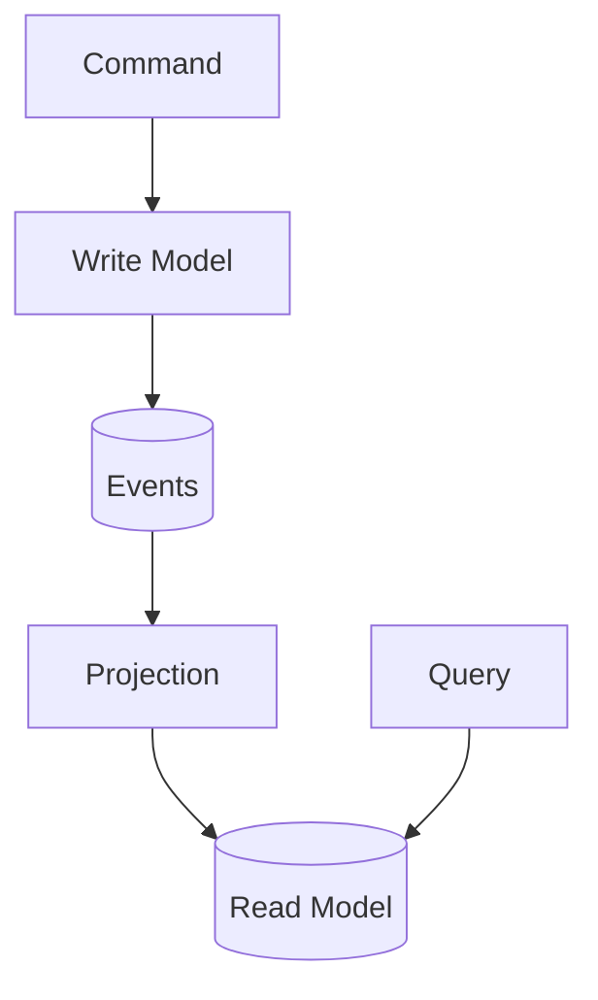

#programming #patterns #architectural-patterns

# CQRS: Dividing Commands and Queries

## Definition

**Command Query Responsibility Segregation (CQRS)** is an architectural pattern that divides a system's behavior into two distinct flows:

- **Commands** that change state.
- **Queries** that read state.

By separating these responsibilities, each model can evolve, scale, and be optimized independently — improving maintainability and performance in distributed environments.
CQRS formalizes the principle that _intent to change_ and _observation of state_ should never be conflated.

### Formal Definition

Let **C** be the set of all _commands_ and **Q** the set of all _queries_.

CQRS enforces two invariants:

1. ∀ `c ∈ C`: `c` may **mutate** system state but must **not return** domain data.
2. ∀ `q ∈ Q`: `q` must **not mutate** state and must be **free of side effects**.

This leads to an **asymmetric architecture**:

- The **write model** manages invariants, consistency, and transactional logic.
- The **read model** prioritizes speed, simplicity, and denormalization.

In distributed systems, writes emit domain events that asynchronously update read models, resulting in **eventual consistency** rather than strict synchronization.

> [!info] Commands vs. Queries
> A command must never return domain data, and a query must never mutate state. If you find yourself doing both in a single operation, you are violating the core CQRS invariant.

## Diagram

### Abstract View



This flow illustrates:

- Commands update state through the **write model**.
- Resulting **events** feed projections that build **read models**.
- Queries read from optimized, side-effect-free stores.

## Example

```rust
use std::collections::HashMap;
use std::sync::{mpsc, Arc, Mutex};
use std::thread;
use std::time::Duration;

/* =======================
   Domain API (CQRS surface)
   ======================= */

#[derive(Debug, Clone)]
pub enum Command {
    PlaceOrder {
        order_id: String,
        customer: String,
        items: Vec<String>,
    },
}

#[derive(Debug, Clone)]
pub enum Event {
    OrderPlaced {
        order_id: String,
        customer: String,
        items: Vec<String>,
    },
}

/* =======================
   Write side (Commands)
   ======================= */

#[derive(Debug, Default)]
struct Order {
    order_id: String,
    customer: String,
    items: Vec<String>,
    status: String,
}

#[derive(Debug)]
struct WriteModel {
    // Domain state for transactional rules and invariants
    orders: HashMap<String, Order>,
    // Simple event bus; in production use Kafka/NATS/etc.
    event_tx: mpsc::Sender<Event>,
}

impl WriteModel {
    fn new(event_tx: mpsc::Sender<Event>) -> Self {
        Self {
            orders: HashMap::new(),
            event_tx,
        }
    }

    /// Command handler
    /// - May mutate domain state
    /// - Must not return domain data (only success/failure)
    fn handle(&mut self, cmd: Command) -> Result<(), String> {
        match cmd {
            Command::PlaceOrder {
                order_id,
                customer,
                items,
            } => {
                if self.orders.contains_key(&order_id) {
                    return Err("Order already exists".into());
                }

                let order = Order {
                    order_id: order_id.clone(),
                    customer: customer.clone(),
                    items: items.clone(),
                    status: "placed".into(),
                };
                self.orders.insert(order_id.clone(), order);

                // Emit domain event for projections
                self.event_tx
                    .send(Event::OrderPlaced {
                        order_id,
                        customer,
                        items,
                    })
                    .map_err(|e| e.to_string())?;

                Ok(())
            }
        }
    }
}

/* =======================
   Read side (Queries)
   ======================= */

#[derive(Debug, Clone)]
struct OrderView {
    customer: String,
    item_count: usize,
    status: String,
}

// Shared, denormalized read view
type SharedView = Arc<Mutex<HashMap<String, OrderView>>>;

#[derive(Clone)]
struct ReadModel {
    view: SharedView,
}

impl ReadModel {
    fn new() -> Self {
        Self {
            view: Arc::new(Mutex::new(HashMap::new())),
        }
    }

    /// Projection applies events to the read model
    fn start_projection(&self, event_rx: mpsc::Receiver<Event>) {
        let view = Arc::clone(&self.view);
        thread::spawn(move || {
            for evt in event_rx {
                match evt {
                    Event::OrderPlaced {
                        order_id,
                        customer,
                        items,
                    } => {
                        let mut v = view.lock().expect("projection lock poisoned");
                        v.insert(
                            order_id,
                            OrderView {
                                customer,
                                item_count: items.len(),
                                status: "placed".into(),
                            },
                        );
                    }
                }
            }
        });
    }

    /// Query: pure read, no side effects
    fn get_order_view(&self, order_id: &str) -> Option<OrderView> {
        self.view.lock().ok().and_then(|v| v.get(order_id).cloned())
    }
}

/* =======================
   Wiring / Demo
   ======================= */

fn main() {
    // Event channel between write and read sides
    let (tx, rx) = mpsc::channel::<Event>();

    // Read side and projection
    let read_model = ReadModel::new();
    read_model.start_projection(rx);

    // Write side
    let mut write_model = WriteModel::new(tx);

    // --- Command: PlaceOrder ---
    write_model
        .handle(Command::PlaceOrder {
            order_id: "A1".into(),
            customer: "Alice".into(),
            items: vec!["apple".into(), "pear".into()],
        })
        .expect("command failed");

    // Give the projection a moment to process (demo only)
    thread::sleep(Duration::from_millis(50));

    // --- Query: read denormalized view ---
    match read_model.get_order_view("A1") {
        Some(view) => println!("Order A1 view => {:?}", view),
        None => println!("Order A1 view not found (projection lag?)"),
    }
}
```

## Trade-offs

### Pros
- Enables **precise domain modeling** through explicit intent.
- Improves **scalability** by decoupling read and write workloads.
- Works naturally with **event sourcing**, where events define the single source of truth.
- Allows **read models** to evolve independently (SQL, NoSQL, caches, etc.).

### Cons
- Increases **operational complexity**: more stores, projections, and pipelines.
- **Debugging** becomes harder — requires observability for projection lag and event replay.
- Enforces **eventual consistency**, demanding well-defined staleness guarantees.
- Overhead may outweigh benefits for simple CRUD systems.

> [!warning] Not for every system
> CQRS introduces significant operational overhead. For straightforward CRUD applications with a single data store, the added complexity of separate read/write models and event pipelines rarely pays off.

## Why It Matters

> [!tip] Idempotent commands
> In distributed contexts, commands may be retried due to network failures or timeouts. Designing command handlers to be idempotent ensures that duplicate deliveries do not produce unintended side effects.

CQRS is about **clarity of intent**. In distributed contexts, command handlers benefit from [[Idempotency|idempotent]] design — ensuring that retried commands do not produce unintended side effects. It transforms "do this and tell me the result" into two explicit steps:

- _Command_ — express what should change.
- _Query_ — observe what is.

In large, distributed, or event-driven systems, this separation simplifies scaling, auditing, and reasoning about state transitions.
When applied with discipline, CQRS creates architectures that are **transparent, composable, and resilient under concurrency**.
