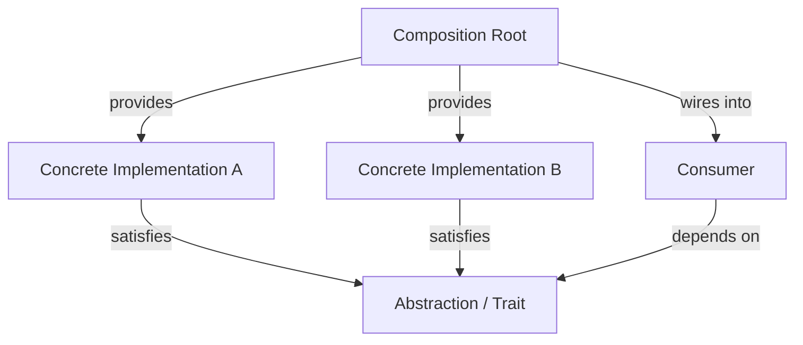

#programming #patterns #architectural-patterns

# Dependency Injection: Externalizing Dependency Resolution

## Definition

Dependency Injection (DI) is an architectural pattern that **inverts control** over how a component obtains its dependencies. Instead of a component deciding which concrete implementation to use, that decision is made externally and the resolved dependency is provided to the component from the outside.

The core insight is separation of two concerns:

- **Declaring** what a component needs (an abstraction — a trait, an interface, a function signature).
- **Deciding** which concrete implementation satisfies that need.

The component only knows the first. The second is handled by the **composition root** — the place in the system where the dependency graph is assembled. This can be done manually or through a **DI Container** that automates resolution, lifecycle management, and wiring.

> [!info] DI vs Passing Arguments
> DI is not just "passing arguments." Passing a value is a mechanism; DI is an **architectural decision** about where in the system dependency resolution happens. A function that takes a string parameter is not using DI. A system where a service declares a trait bound and a composition root decides which implementation to wire in — that is DI.

> [!warning] DI is not class-specific
> DI applies equally to functions, closures, modules, and trait implementations. Any component that depends on an abstraction and receives its concrete dependency from outside is participating in DI, regardless of whether classes or OOP are involved.

## Diagram



The consumer depends only on the abstraction. The composition root decides which implementation the consumer receives. The consumer never participates in that decision.

## Example

### Trait-based DI

```rust
trait Storage {
    fn load(&self, key: &str) -> Option<String>;
    fn store(&self, key: &str, value: &str);
}

// --- Two implementations of the same abstraction ---

struct DiskStorage {
    base_path: String,
}

impl Storage for DiskStorage {
    fn load(&self, key: &str) -> Option<String> {
        std::fs::read_to_string(format!("{}/{key}", self.base_path)).ok()
    }

    fn store(&self, key: &str, value: &str) {
        std::fs::write(format!("{}/{key}", self.base_path), value).ok();
    }
}

struct InMemoryStorage {
    data: std::cell::RefCell<std::collections::HashMap<String, String>>,
}

impl InMemoryStorage {
    fn new() -> Self {
        Self {
            data: std::cell::RefCell::new(std::collections::HashMap::new()),
        }
    }
}

impl Storage for InMemoryStorage {
    fn load(&self, key: &str) -> Option<String> {
        self.data.borrow().get(key).cloned()
    }

    fn store(&self, key: &str, value: &str) {
        self.data.borrow_mut().insert(key.into(), value.into());
    }
}

// --- Consumer: depends on the abstraction, not the implementation ---

fn save_user_profile(storage: &dyn Storage, user_id: &str, profile_json: &str) {
    let key = format!("profiles/{user_id}");
    storage.store(&key, profile_json);
    println!("Profile saved for {user_id}");
}

fn load_user_profile(storage: &dyn Storage, user_id: &str) -> Option<String> {
    storage.load(&format!("profiles/{user_id}"))
}

// --- Composition Root: this is where DI happens ---

fn main() {
    // The composition root decides which implementation to use.
    // Swap DiskStorage for InMemoryStorage without changing any consumer code.
    let storage = InMemoryStorage::new();

    save_user_profile(&storage, "alice", r#"{"name":"Alice"}"#);
    let profile = load_user_profile(&storage, "alice");
    println!("Loaded: {profile:?}");
}
```

> [!tip] Composition root
> Notice that `save_user_profile` and `load_user_profile` have no idea what `Storage` they are working with. The `main` function is the composition root — the single place where the concrete dependency is chosen and wired in.

### Functional DI with Closures

```rust
fn process_payment(
    charge: &dyn Fn(f64) -> Result<String, String>,
    notify: &dyn Fn(&str, &str),
    customer: &str,
    amount: f64,
) {
    match charge(amount) {
        Ok(txn_id) => {
            notify(customer, &format!("Payment {txn_id} confirmed: ${amount:.2}"));
        }
        Err(e) => {
            notify(customer, &format!("Payment failed: {e}"));
        }
    }
}

fn main() {
    // Production dependencies
    let charge = |amount: f64| -> Result<String, String> {
        println!("Charging ${amount:.2} via Stripe...");
        Ok("txn_abc123".into())
    };

    let notify = |to: &str, msg: &str| {
        println!("Email to {to}: {msg}");
    };

    process_payment(&charge, &notify, "alice@example.com", 99.99);

    // Test dependencies — same function, different behavior
    let fake_charge = |_: f64| -> Result<String, String> {
        Ok("fake_txn".into())
    };

    let mut messages: Vec<String> = Vec::new();
    let capture_notify = |_to: &str, msg: &str| {
        // In a real test you'd capture these
        println!("[captured] {msg}");
    };

    process_payment(&fake_charge, &capture_notify, "test@test.com", 50.0);
}
```

> [!info] No traits, no structs
> This example uses plain closures as dependencies. DI does not require any particular language feature — only the principle that the consumer declares what it needs and the caller provides it.

### DI Container

In larger systems, manually wiring every dependency becomes tedious. A **DI Container** automates this by maintaining a registry of abstractions and their implementations, resolving the full dependency graph on demand.

```rust
use std::any::{Any, TypeId};
use std::collections::HashMap;

struct Container {
    registry: HashMap<TypeId, Box<dyn Any>>,
}

impl Container {
    fn new() -> Self {
        Self {
            registry: HashMap::new(),
        }
    }

    fn register<T: 'static>(&mut self, instance: T) {
        self.registry.insert(TypeId::of::<T>(), Box::new(instance));
    }

    fn resolve<T: 'static>(&self) -> Option<&T> {
        self.registry
            .get(&TypeId::of::<T>())
            .and_then(|boxed| boxed.downcast_ref::<T>())
    }
}

struct DatabaseUrl(String);
struct MaxRetries(u32);

fn main() {
    let mut container = Container::new();
    container.register(DatabaseUrl("postgres://localhost/app".into()));
    container.register(MaxRetries(3));

    let db_url = container.resolve::<DatabaseUrl>().unwrap();
    let retries = container.resolve::<MaxRetries>().unwrap();

    println!("DB: {}, Retries: {}", db_url.0, retries.0);
}
```

> [!warning] Containers add complexity
> A DI Container is a tool, not a requirement. Manual wiring at the composition root is often simpler and provides compile-time safety. Containers trade that safety for convenience in large systems with deep dependency graphs. Use them when the wiring complexity justifies the abstraction.

## Trade-offs

### Pros
- Components depend on abstractions, not concrete implementations — loose coupling throughout the system.
- Dependencies are declared explicitly — the dependency graph is visible and auditable.
- Testing becomes trivial — swap any dependency for a fake without touching the consumer.
- The composition root is the single place where wiring decisions live — easy to reconfigure per environment.

### Cons
- The composition root can become complex in large systems with deep dependency graphs.
- DI Containers sacrifice compile-time safety for runtime resolution — misconfiguration surfaces at runtime.
- Over-applying DI to trivial, stable dependencies (pure functions, standard library types) adds indirection without value.
- Reading the code requires following the wiring to understand which implementation is actually used.

## Why It Matters

### When it helps
- Components interact with external systems (databases, APIs, file systems) that must be replaceable in tests.
- The same codebase runs in different environments (dev, staging, production) with different infrastructure.
- A library or framework must let consumers provide their own implementations.
- The dependency graph is complex enough that centralizing wiring decisions improves clarity.

### When not to use
- The dependency is a pure function or a deterministic computation — just call it directly.
- There is exactly one implementation with no realistic alternative — the abstraction is ceremony.
- The system is small enough that the dependency graph is obvious and wiring is trivial.
- Introducing DI would force an abstraction where none exists naturally — do not invent traits solely to enable injection.
