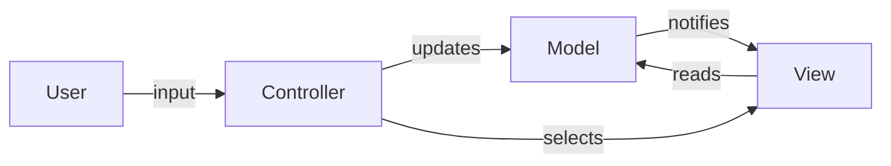

#programming #patterns #architectural-patterns

# MVC: Separating Input, Output, and Data

## Definition

**Model-View-Controller (MVC)** divides an application into three interconnected components:

- **Model** — owns the data and business rules. Notifies observers when state changes.
- **View** — renders the Model's data for the user. Reads directly from the Model.
- **Controller** — receives user input, translates it into actions on the Model, and selects the appropriate View.

The key characteristic of MVC is that the View **pulls** data from the Model and the Controller orchestrates input handling. The Model is unaware of the Controller; it only notifies registered Views through an observer mechanism.

MVC originated in Smalltalk-80 and is the foundation for [[MVP]] and [[MVVM]], which refine the communication flow between layers.

> [!info] The Model owns the truth
> The Model is the only component that holds and mutates application state. The View reads from it, and the Controller writes to it, but neither should duplicate or cache its data independently.

## Diagram



## Example

```rust
// --- Model ---

type Listener = Box<dyn Fn(&[String])>;

struct TodoModel {
    items: Vec<String>,
    listeners: Vec<Listener>,
}

impl TodoModel {
    fn new() -> Self {
        Self {
            items: Vec::new(),
            listeners: Vec::new(),
        }
    }

    fn subscribe(&mut self, listener: Listener) {
        self.listeners.push(listener);
    }

    fn add(&mut self, item: &str) {
        self.items.push(item.to_string());
        self.notify();
    }

    fn remove(&mut self, index: usize) {
        if index < self.items.len() {
            self.items.remove(index);
            self.notify();
        }
    }

    fn notify(&self) {
        for listener in &self.listeners {
            listener(&self.items);
        }
    }
}

// --- View (reads from Model via callback) ---

fn render_list(items: &[String]) {
    println!("--- Todo List ---");
    if items.is_empty() {
        println!("  (empty)");
    }
    for (i, item) in items.iter().enumerate() {
        println!("  [{}] {}", i, item);
    }
}

// --- Controller ---

fn controller_add(model: &mut TodoModel, input: &str) {
    if !input.is_empty() {
        model.add(input);
    }
}

fn controller_remove(model: &mut TodoModel, index: usize) {
    model.remove(index);
}

fn main() {
    let mut model = TodoModel::new();
    model.subscribe(Box::new(|items| render_list(items)));

    controller_add(&mut model, "Buy groceries");
    controller_add(&mut model, "Write tests");
    controller_remove(&mut model, 0);
}
```

## Trade-offs

### Pros
- Clear separation of concerns — Model, View, and Controller evolve independently.
- The Model is reusable across different Views and Controllers.
- Well understood — decades of community knowledge and framework support.

### Cons
- The View's direct dependency on the Model can create tight coupling in practice.
- Controllers tend to grow large ("fat controller" problem) as application complexity increases.
- Multiple Views observing the same Model can lead to update cascades that are hard to trace.

> [!warning] Fat controllers
> As features accumulate, Controllers tend to absorb business logic that belongs in the Model. Keep Controllers thin by delegating domain operations to the Model layer.

## Why It Matters

### When it helps
- Server-side web frameworks (Rails, Django, Spring MVC) where the request/response cycle maps naturally to Controller → Model → View.
- Applications with multiple Views of the same data (dashboard + detail + chart).
- Teams that want a well-established, widely-documented architecture.

### When not to use
- Rich client UIs with heavy two-way data binding — [[MVVM]] is a better fit.
- Simple scripts or CLI tools where separation adds overhead without benefit.
- When the framework already dictates a different pattern — fighting it creates friction.

> [!note] MVC vs. MVP vs. MVVM
> All three patterns separate concerns between data, presentation, and user input. The key difference is how the View gets its data: in MVC the View **pulls** from the Model, in [[MVP]] the Presenter **pushes** to the View, and in [[MVVM]] the View **binds** to observable state.
