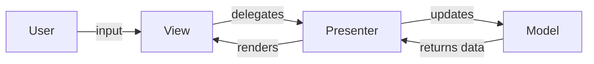

#programming #patterns #architectural-patterns

# MVP: Testable Presentation Through a Middleman

## Definition

**Model-View-Presenter (MVP)** refines [[MVC]] by inserting a **Presenter** between the View and the Model. The View is passive — it forwards all user input to the Presenter and exposes an interface that the Presenter calls to update the display. The View never reads from the Model directly.

This makes the Presenter fully testable without a real UI: tests inject a mock View, call Presenter methods, and assert which View methods were invoked.

Two common variants exist:

- **Passive View** — the View contains zero logic; the Presenter sets every field explicitly.
- **Supervising Controller** — the View handles simple data binding, and the Presenter manages complex logic only.

> [!tip] Choosing a variant
> Prefer **Passive View** when maximum testability matters -- every UI behavior flows through the Presenter and can be verified. Use **Supervising Controller** when simple data binding reduces boilerplate without sacrificing meaningful test coverage.

## Diagram



## Example

```rust
// --- Model ---

struct UserRepository {
    users: Vec<(u64, String, String)>, // id, name, email
}

impl UserRepository {
    fn new() -> Self {
        Self {
            users: vec![
                (1, "Alice".into(), "alice@example.com".into()),
                (2, "Bob".into(), "bob@example.com".into()),
            ],
        }
    }

    fn find(&self, id: u64) -> Option<(&str, &str)> {
        self.users
            .iter()
            .find(|(uid, _, _)| *uid == id)
            .map(|(_, name, email)| (name.as_str(), email.as_str()))
    }
}

// --- View interface (the contract the Presenter drives) ---

trait UserView {
    fn show_user(&self, name: &str, email: &str);
    fn show_error(&self, message: &str);
}

// --- Presenter ---

struct UserPresenter<V: UserView> {
    view: V,
    repo: UserRepository,
}

impl<V: UserView> UserPresenter<V> {
    fn new(view: V, repo: UserRepository) -> Self {
        Self { view, repo }
    }

    fn on_user_selected(&self, id: u64) {
        match self.repo.find(id) {
            Some((name, email)) => self.view.show_user(name, email),
            None => self.view.show_error("User not found"),
        }
    }
}

// --- Concrete View (console) ---

struct ConsoleView;

impl UserView for ConsoleView {
    fn show_user(&self, name: &str, email: &str) {
        println!("User: {} <{}>", name, email);
    }

    fn show_error(&self, message: &str) {
        println!("Error: {}", message);
    }
}

fn main() {
    let presenter = UserPresenter::new(ConsoleView, UserRepository::new());

    presenter.on_user_selected(1); // User: Alice <alice@example.com>
    presenter.on_user_selected(3); // Error: User not found
}
```

## Trade-offs

### Pros
- The Presenter is fully unit-testable — inject a mock View and assert calls.
- The View is thin and contains no business logic, reducing UI-layer bugs.
- Clean separation makes it easy to swap the View (console, web, mobile).

### Cons
- The Presenter must explicitly push every piece of data to the View — more boilerplate than [[MVC]].
- Presenters can grow large when the View has many interactive elements.
- Requires defining a View interface (trait) for every screen or component.

> [!warning] Presenter bloat
> Like Controllers in [[MVC]], Presenters can grow unwieldy as screen complexity increases. Consider splitting a large Presenter into smaller, focused Presenters that each handle a subset of the View's responsibilities.

## Why It Matters

### When it helps
- Desktop or mobile applications where UI testing is expensive and the Presenter must be tested without rendering.
- Teams that want strict separation between UI and logic without relying on data-binding frameworks.
- Legacy UIs where you need to extract testable logic without rewriting the View layer.

> [!info] Key advantage over MVC
> The View never reads from the Model directly. All data flows through the Presenter, giving you a single place to intercept, transform, and test every interaction between the UI and the domain.

### When not to use
- Reactive/declarative UI frameworks (React, SwiftUI) where [[MVVM]] with data binding is more natural.
- Server-side rendering where the request/response cycle fits [[MVC]] better.
- Very simple screens where a Presenter adds indirection without testability gains.
