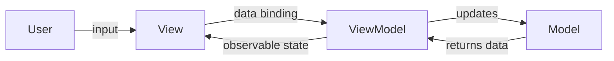

#programming #patterns #architectural-patterns

# MVVM: Reactive UI Through Data Binding

## Definition

**Model-View-ViewModel (MVVM)** separates the UI from business logic by introducing a **ViewModel** that exposes observable state. The View **binds** to the ViewModel's properties and reacts to changes automatically — no explicit update calls are needed.

- **Model** — domain data and business rules.
- **View** — declares how to render state; subscribes to ViewModel observables.
- **ViewModel** — transforms Model data into a form the View can display, handles user actions, and notifies the View through reactive bindings.

Unlike [[MVP]], the ViewModel does not hold a reference to the View. It publishes state changes, and any View that binds to it receives updates. This makes the ViewModel inherently testable and decoupled from any specific UI framework.

> [!info] Key distinction from MVP
> In [[MVP]], the Presenter holds a direct reference to the View interface. In MVVM, the ViewModel has no knowledge of the View at all -- it simply exposes observable state. This makes it possible to bind multiple Views to the same ViewModel without any modification.

## Diagram



## Example

```rust
use std::cell::RefCell;
use std::rc::Rc;

// --- Observable (simplified reactive primitive) ---

type Subscriber<T> = Box<dyn Fn(&T)>;

struct Observable<T> {
    value: T,
    subscribers: Vec<Subscriber<T>>,
}

impl<T: Clone> Observable<T> {
    fn new(value: T) -> Self {
        Self {
            value,
            subscribers: Vec::new(),
        }
    }

    fn get(&self) -> &T {
        &self.value
    }

    fn set(&mut self, value: T) {
        self.value = value;
        for sub in &self.subscribers {
            sub(&self.value);
        }
    }

    fn subscribe(&mut self, f: Subscriber<T>) {
        f(&self.value); // emit current value immediately
        self.subscribers.push(f);
    }
}

// --- Model ---

struct CounterModel {
    count: i32,
}

impl CounterModel {
    fn new() -> Self {
        Self { count: 0 }
    }
}

// --- ViewModel ---

struct CounterViewModel {
    model: CounterModel,
    display_text: Observable<String>,
}

impl CounterViewModel {
    fn new() -> Self {
        let model = CounterModel::new();
        let display_text = Observable::new(format!("Count: {}", model.count));
        Self {
            model,
            display_text,
        }
    }

    fn increment(&mut self) {
        self.model.count += 1;
        self.display_text
            .set(format!("Count: {}", self.model.count));
    }

    fn decrement(&mut self) {
        self.model.count -= 1;
        self.display_text
            .set(format!("Count: {}", self.model.count));
    }

    fn subscribe_display(&mut self, f: Subscriber<String>) {
        self.display_text.subscribe(f);
    }
}

// --- View (binds to ViewModel observables) ---

fn main() {
    let vm = Rc::new(RefCell::new(CounterViewModel::new()));

    // View binds to the ViewModel's observable
    vm.borrow_mut().subscribe_display(Box::new(|text| {
        println!("[View] {}", text);
    }));

    // Simulate user actions
    vm.borrow_mut().increment(); // [View] Count: 1
    vm.borrow_mut().increment(); // [View] Count: 2
    vm.borrow_mut().decrement(); // [View] Count: 1
}
```

## Trade-offs

### Pros
- Two-way data binding eliminates manual View update code — less boilerplate.
- The ViewModel is testable without a UI — observe state changes in tests.
- Multiple Views can bind to the same ViewModel without modification.

### Cons
- Data binding can obscure control flow — harder to debug than explicit method calls.
- Memory leaks if subscriptions are not properly cleaned up.
- Overhead of the reactive layer may be unjustified for simple screens.

> [!danger] Subscription leaks
> Every binding is a subscription. If Views are created and destroyed without unsubscribing, the ViewModel will hold references to dead Views, causing memory leaks. Always clean up bindings when a View is disposed.

## Why It Matters

### When it helps
- Reactive/declarative UI frameworks (WPF, SwiftUI, Jetpack Compose, Vue, React with state management).
- Complex forms or dashboards where many UI elements reflect the same underlying state.
- Teams that want ViewModel testability without coupling to a View interface (unlike [[MVP]]).

### When not to use
- Server-side applications with stateless request/response cycles — [[MVC]] is more natural.
- Tiny applications where the reactive infrastructure costs more than it saves.
- Frameworks without data-binding support — implementing it manually recreates [[MVP]].

> [!tip] Debugging reactive bindings
> When data binding obscures control flow, add logging or breakpoints inside the ViewModel's `set` methods rather than tracing through the binding framework. The ViewModel is the single source of truth for what changed and when.
