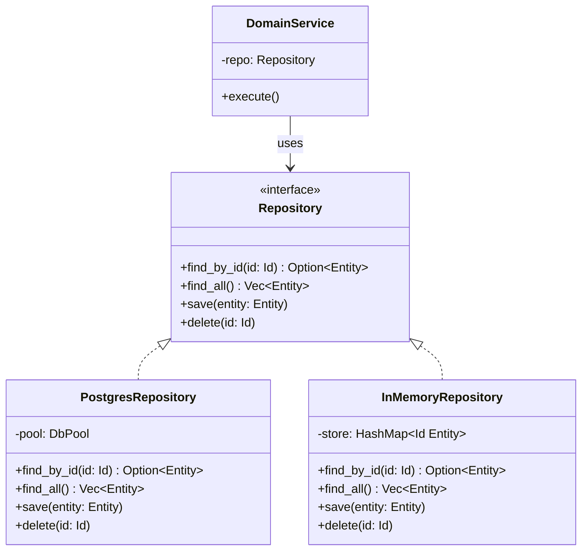

#programming #patterns #architectural-patterns

# Repository Pattern: Abstracting Data Access

## Definition

The Repository pattern mediates between the domain layer and the data source by providing a collection-like interface for accessing domain objects. The domain code works with repositories as if they were in-memory collections, while the repository implementation handles persistence details — database queries, API calls, file I/O.

This keeps business logic free of storage concerns and makes it possible to swap data sources or use in-memory fakes during testing.

> [!info] Think of it as a collection
> Domain code should interact with a repository as if it were a simple in-memory collection (`find`, `save`, `delete`). If your repository interface exposes SQL, connection pools, or API details, the abstraction is leaking.

## Diagram



## Example

```rust
use std::collections::HashMap;

// --- Domain ---

#[derive(Debug, Clone)]
struct Product {
    id: u64,
    name: String,
    price_cents: u64,
}

// --- Repository trait ---

trait ProductRepository {
    fn find_by_id(&self, id: u64) -> Option<Product>;
    fn find_all(&self) -> Vec<Product>;
    fn save(&mut self, product: Product);
    fn delete(&mut self, id: u64);
}

// --- In-memory implementation (used in tests) ---

struct InMemoryProductRepo {
    store: HashMap<u64, Product>,
}

impl InMemoryProductRepo {
    fn new() -> Self {
        Self {
            store: HashMap::new(),
        }
    }
}

impl ProductRepository for InMemoryProductRepo {
    fn find_by_id(&self, id: u64) -> Option<Product> {
        self.store.get(&id).cloned()
    }

    fn find_all(&self) -> Vec<Product> {
        self.store.values().cloned().collect()
    }

    fn save(&mut self, product: Product) {
        self.store.insert(product.id, product);
    }

    fn delete(&mut self, id: u64) {
        self.store.remove(&id);
    }
}

// --- Domain service uses the repository ---

fn apply_discount(repo: &mut dyn ProductRepository, id: u64, percent: u64) {
    if let Some(mut product) = repo.find_by_id(id) {
        product.price_cents -= product.price_cents * percent / 100;
        println!(
            "Discounted {} to {} cents",
            product.name, product.price_cents
        );
        repo.save(product);
    }
}

fn main() {
    let mut repo = InMemoryProductRepo::new();

    repo.save(Product {
        id: 1,
        name: "Widget".into(),
        price_cents: 1000,
    });
    repo.save(Product {
        id: 2,
        name: "Gadget".into(),
        price_cents: 2500,
    });

    apply_discount(&mut repo, 1, 20); // Widget: 1000 → 800

    println!("All products: {:?}", repo.find_all());
}
```

## Trade-offs

### Pros
- Domain logic is completely independent of storage technology.
- Easy to test — swap the real repository for an in-memory fake.
- Centralizes query logic — prevents scattered SQL or API calls across the codebase.

### Cons
- Adds an abstraction layer that may be unnecessary for simple CRUD.
- Complex queries can be awkward to express through a generic collection interface.
- Risk of "leaky abstraction" when database-specific features (joins, transactions) bleed through.

> [!warning] Avoid generic mega-repositories
> A single `Repository<T>` with every possible query method becomes a dumping ground. Prefer focused, domain-specific repository interfaces (e.g., `ProductRepository`, `OrderRepository`) with only the methods that the domain actually needs.

## Why It Matters

### When it helps
- The data source may change (SQL → NoSQL, local → remote) and business logic must be insulated.
- You want fast, isolated unit tests that do not require a running database.
- Multiple parts of the application access the same data and query logic should not be duplicated.

### When not to use
- The application is a thin CRUD layer with no meaningful business logic — the repository just mirrors the ORM.
- You are using an ORM that already provides repository-like abstractions.
- There is zero chance of swapping the data store and the extra layer adds only boilerplate.

> [!tip] Testing payoff
> Even if you never swap your database, the Repository pattern pays for itself in testing. An in-memory implementation lets you run fast, deterministic unit tests without spinning up a database or managing test fixtures.
