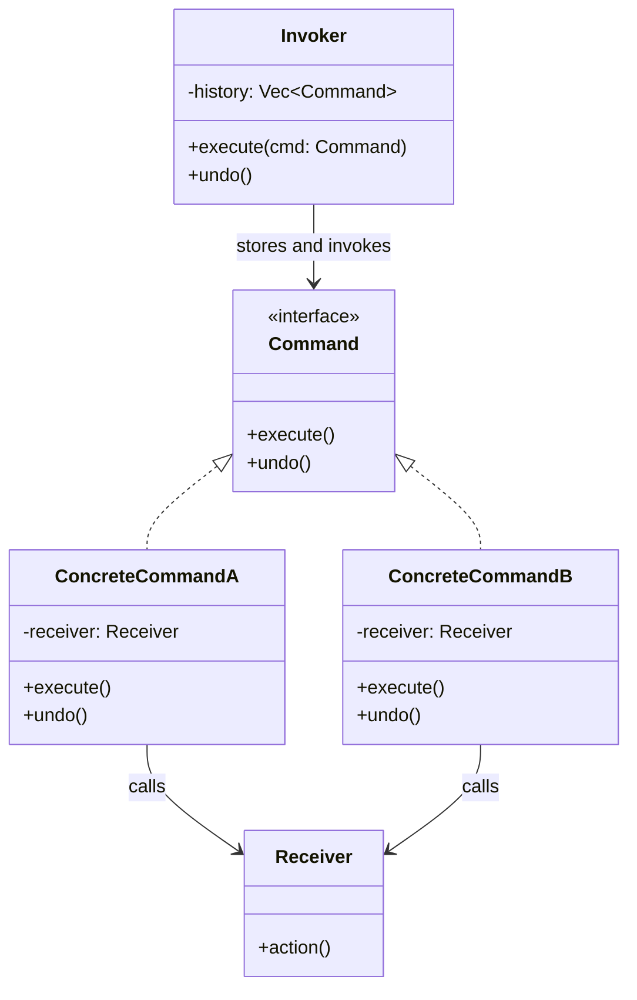

#programming #patterns #behavioral-patterns

# Command Pattern: Encapsulating Requests as Objects

## Definition

The Command pattern turns a request into a stand-alone object that contains all information needed to perform the action. This decouples the invoker (who triggers the action) from the receiver (who performs it), and enables features like undo/redo, queuing, logging, and macro recording.

## Diagram



## Example

```rust
trait Command {
    fn execute(&mut self);
    fn undo(&mut self);
}

// Receiver
struct TextEditor {
    content: String,
}

impl TextEditor {
    fn new() -> Self {
        Self {
            content: String::new(),
        }
    }
}

// Concrete command: insert text
struct InsertText<'a> {
    editor: &'a mut TextEditor,
    text: String,
    position: usize,
}

// We need a different approach for multiple commands mutating the same editor.
// Use a shared reference via index into a Vec or RefCell. Here we use a
// simpler standalone approach:

struct EditorState {
    content: String,
}

trait EditorCommand {
    fn execute(&self, state: &mut EditorState);
    fn undo(&self, state: &mut EditorState);
}

struct Insert {
    position: usize,
    text: String,
}

impl EditorCommand for Insert {
    fn execute(&self, state: &mut EditorState) {
        state.content.insert_str(self.position, &self.text);
    }

    fn undo(&self, state: &mut EditorState) {
        let end = self.position + self.text.len();
        state.content.replace_range(self.position..end, "");
    }
}

struct Delete {
    position: usize,
    length: usize,
    deleted: String, // saved for undo
}

impl Delete {
    fn new(position: usize, length: usize) -> Self {
        Self {
            position,
            length,
            deleted: String::new(),
        }
    }
}

impl EditorCommand for Delete {
    fn execute(&self, state: &mut EditorState) {
        // In a real implementation, `deleted` would be captured here
        let end = self.position + self.length;
        state.content.replace_range(self.position..end, "");
    }

    fn undo(&self, state: &mut EditorState) {
        state.content.insert_str(self.position, &self.deleted);
    }
}

struct CommandHistory {
    state: EditorState,
    history: Vec<Box<dyn EditorCommand>>,
}

impl CommandHistory {
    fn new() -> Self {
        Self {
            state: EditorState {
                content: String::new(),
            },
            history: Vec::new(),
        }
    }

    fn execute(&mut self, cmd: Box<dyn EditorCommand>) {
        cmd.execute(&mut self.state);
        self.history.push(cmd);
    }

    fn undo(&mut self) {
        if let Some(cmd) = self.history.pop() {
            cmd.undo(&mut self.state);
        }
    }
}

fn main() {
    let mut editor = CommandHistory::new();

    editor.execute(Box::new(Insert {
        position: 0,
        text: "Hello, world!".into(),
    }));
    println!("{}", editor.state.content); // Hello, world!

    editor.execute(Box::new(Insert {
        position: 5,
        text: " beautiful".into(),
    }));
    println!("{}", editor.state.content); // Hello beautiful, world!

    editor.undo();
    println!("{}", editor.state.content); // Hello, world!

    editor.undo();
    println!("{}", editor.state.content); // (empty)
}
```

> [!tip] Key Insight
> The Command pattern is essentially the object-oriented equivalent of a first-class function. Each command object captures an action and its parameters, just like a closure — but with the added ability to implement `undo`.

## Trade-offs

### Pros
- Decouples the object that invokes an operation from the one that performs it.
- Commands are first-class objects — they can be stored, queued, serialized, and replayed.
- Undo/redo becomes straightforward by maintaining a command history.
- Supports macro recording and transaction-like batching.

### Cons
- Increases the number of classes — one per operation.
- Capturing state for reliable undo can be complex.
- Adds indirection between the trigger and the actual work.

## Why It Matters

### When it helps
- You need undo/redo functionality (text editors, drawing tools, form wizards).
- Operations must be queued, scheduled, or executed remotely.
- You want to log every action for auditing or replay (similar to [[Event Sourcing]]).

### When not to use
- The action is simple and there is no need for undo, queuing, or logging.
- Commands would be trivial wrappers around single function calls — closures are simpler.
- Capturing undo state is impractical or too expensive.

> [!warning] Undo Complexity
> Reliable undo requires each command to capture enough state to reverse its effect. For destructive operations like `Delete`, you must snapshot the deleted content *before* execution — otherwise undo is impossible.
