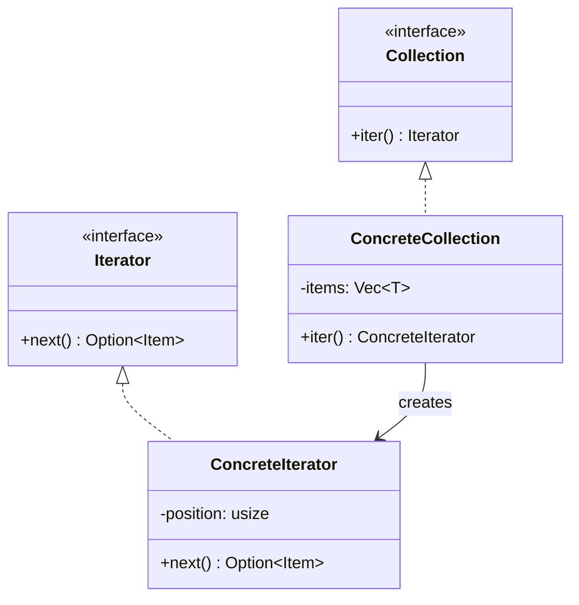

#programming #patterns #behavioral-patterns

# Iterator Pattern: Traversing Collections Without Exposing Internals

## Definition

The Iterator pattern provides a way to access the elements of a collection sequentially without exposing its underlying representation. The collection hands out an iterator object that knows how to step through elements one by one, hiding whether the data lives in an array, tree, graph, or stream.

In Rust this pattern is built into the language through the `Iterator` and `IntoIterator` traits, making it the most pervasive pattern in the standard library.

> [!info] Rust's Iterator Ecosystem
> Implementing `Iterator` (just the `next` method) unlocks dozens of free adapter methods like `map`, `filter`, `take`, `zip`, `collect`, and more. Implementing `IntoIterator` enables `for`-loop support.

## Diagram



## Example

### Custom iterator over a range

```rust
struct Countdown {
    current: u32,
}

impl Countdown {
    fn new(start: u32) -> Self {
        Self { current: start }
    }
}

impl Iterator for Countdown {
    type Item = u32;

    fn next(&mut self) -> Option<Self::Item> {
        if self.current == 0 {
            None
        } else {
            let value = self.current;
            self.current -= 1;
            Some(value)
        }
    }
}

fn main() {
    for n in Countdown::new(5) {
        print!("{} ", n); // 5 4 3 2 1
    }
    println!();
}
```

### Custom collection with `IntoIterator`

```rust
struct Ring<T> {
    items: Vec<T>,
}

impl<T> Ring<T> {
    fn new(items: Vec<T>) -> Self {
        Self { items }
    }
}

struct RingIter<'a, T> {
    ring: &'a Ring<T>,
    index: usize,
    count: usize,
}

impl<'a, T> Iterator for RingIter<'a, T> {
    type Item = &'a T;

    fn next(&mut self) -> Option<Self::Item> {
        if self.ring.items.is_empty() || self.count >= self.ring.items.len() {
            return None;
        }
        let item = &self.ring.items[self.index % self.ring.items.len()];
        self.index += 1;
        self.count += 1;
        Some(item)
    }
}

impl<'a, T> IntoIterator for &'a Ring<T> {
    type Item = &'a T;
    type IntoIter = RingIter<'a, T>;

    fn into_iter(self) -> Self::IntoIter {
        RingIter {
            ring: self,
            index: 0,
            count: 0,
        }
    }
}

fn main() {
    let ring = Ring::new(vec!["A", "B", "C"]);

    // Works with for-in thanks to IntoIterator
    for item in &ring {
        print!("{} ", item); // A B C
    }
    println!();
}
```

## Trade-offs

### Pros
- Decouples traversal from data structure — the same collection can support multiple iterator types.
- Composes with the entire iterator adapter ecosystem (`map`, `filter`, `take`, `zip`, etc.).
- Lazy evaluation — elements are produced on demand, enabling infinite sequences.

### Cons
- Custom iterators require boilerplate (struct + `impl Iterator`).
- Lifetime complexity when iterating over borrowed data in Rust.
- Iterator invalidation if the underlying collection is mutated during traversal.

> [!warning] Iterator Invalidation
> Rust's borrow checker prevents most iterator invalidation at compile time — you cannot mutate a collection while iterating over it. Other languages (C++, Java) only detect this at runtime, often through crashes or `ConcurrentModificationException`.

## Why It Matters

### When it helps
- You have a custom data structure (tree, graph, ring buffer) and clients should traverse it without knowing the internals.
- You want to leverage Rust's iterator adapters and `for`-loop integration.
- Lazy processing of large or infinite sequences is needed.

### When not to use
- The collection is a plain `Vec` or `HashMap` that already provides iterators — no custom implementation needed.
- Random access is the primary access pattern — iterators are sequential by nature.
