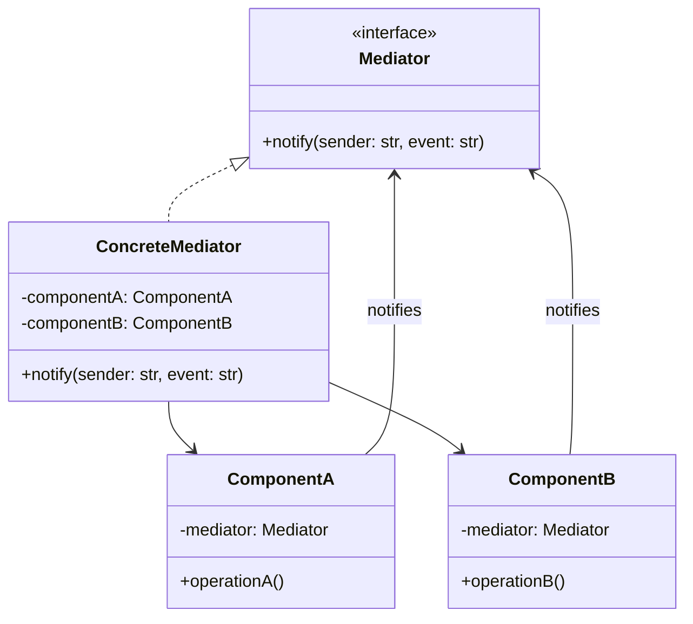

#programming #patterns #behavioral-patterns

# Mediator Pattern: Centralizing Object Interaction

## Definition

The Mediator pattern defines an object that encapsulates how a set of objects interact. Instead of components referencing each other directly (forming a mesh of dependencies), they communicate through the mediator — reducing coupling from many-to-many to many-to-one.

The mediator becomes the single coordination point: it receives notifications from one component and routes them to the appropriate others.

## Diagram



## Example

```rust
use std::collections::HashMap;

type Handler = Box<dyn Fn(&str)>;

struct EventMediator {
    handlers: HashMap<String, Vec<Handler>>,
}

impl EventMediator {
    fn new() -> Self {
        Self {
            handlers: HashMap::new(),
        }
    }

    fn register(&mut self, event: &str, handler: Handler) {
        self.handlers
            .entry(event.to_string())
            .or_default()
            .push(handler);
    }

    fn notify(&self, event: &str, data: &str) {
        if let Some(handlers) = self.handlers.get(event) {
            for handler in handlers {
                handler(data);
            }
        }
    }
}

// Components communicate only through the mediator

struct AuthService;
impl AuthService {
    fn login(&self, mediator: &EventMediator, user: &str) {
        println!("[Auth] {} logged in", user);
        mediator.notify("user_logged_in", user);
    }
}

struct ProfileService;
impl ProfileService {
    fn on_login(&self, user: &str) {
        println!("[Profile] Loading profile for {}", user);
    }
}

struct NotificationService;
impl NotificationService {
    fn on_login(&self, user: &str) {
        println!("[Notification] Welcome back, {}!", user);
    }
}

struct AnalyticsService;
impl AnalyticsService {
    fn on_login(&self, user: &str) {
        println!("[Analytics] Login event recorded for {}", user);
    }
}

fn main() {
    let mut mediator = EventMediator::new();

    // Register handlers — components don't know about each other
    mediator.register("user_logged_in", Box::new(|user| {
        ProfileService.on_login(user);
    }));
    mediator.register("user_logged_in", Box::new(|user| {
        NotificationService.on_login(user);
    }));
    mediator.register("user_logged_in", Box::new(|user| {
        AnalyticsService.on_login(user);
    }));

    // Auth triggers login — mediator routes to all interested parties
    AuthService.login(&mediator, "Alice");
}
```

## Trade-offs

### Pros
- Eliminates direct dependencies between components — each only knows the mediator.
- Centralizes interaction logic, making it easier to understand and modify workflows.
- Components become reusable in isolation since they carry no knowledge of peers.

### Cons
> [!danger] God Object Risk
> As more components are added, the mediator tends to absorb coordination logic from everywhere. If it starts containing business rules rather than just routing, it has become a god object — consider splitting it into multiple focused mediators.

- The mediator can grow into a "god object" that concentrates too much logic.
- Indirection makes it harder to trace the flow of control during debugging.
- All coordination funnels through one point, which can become a bottleneck.

## Why It Matters

### When it helps
- Multiple components interact in complex ways and direct references create a tangled web.
- UI dialog boxes where buttons, text fields, and checkboxes must coordinate.
- Microservice orchestration where a central coordinator manages workflows across services.

### When not to use
- Components have simple, well-defined relationships — direct calls are clearer.
- You need decentralized, peer-to-peer communication (consider [[Observer]] instead).
- The mediator would merely proxy calls without adding coordination logic.

> [!note] Mediator vs Observer
> Both decouple senders from receivers. The key difference: a Mediator *centralizes* control (it knows the routing rules), while an Observer *distributes* it (each observer decides independently how to react). Choose Mediator when you need orchestration; choose Observer when you need broadcast.
