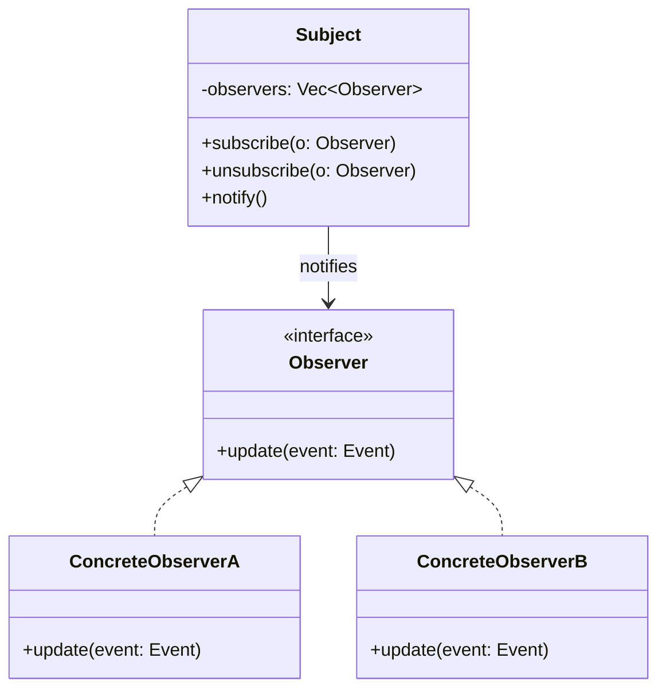

#programming #patterns #behavioral-patterns

# Observer Pattern: Reacting to Events

## Definition

The Observer pattern defines a one-to-many dependency between objects: when one object (the **subject**) changes state, all registered dependents (**observers**) are notified automatically. This decouples the source of an event from the code that reacts to it.

## Diagram



## Example

### Callback-based

```rust
type Listener = Box<dyn Fn(&str, f64)>;

struct PriceTracker {
    price: f64,
    listeners: Vec<Listener>,
}

impl PriceTracker {
    fn new(initial_price: f64) -> Self {
        Self {
            price: initial_price,
            listeners: Vec::new(),
        }
    }

    fn subscribe(&mut self, listener: Listener) {
        self.listeners.push(listener);
    }

    fn set_price(&mut self, symbol: &str, new_price: f64) {
        self.price = new_price;
        for listener in &self.listeners {
            listener(symbol, new_price);
        }
    }
}

fn main() {
    let mut tracker = PriceTracker::new(100.0);

    tracker.subscribe(Box::new(|symbol, price| {
        println!("[Dashboard] {} is now ${:.2}", symbol, price);
    }));

    tracker.subscribe(Box::new(|symbol, price| {
        if price > 150.0 {
            println!("[Alert] {} exceeded $150: ${:.2}", symbol, price);
        }
    }));

    tracker.set_price("ACME", 120.0);
    tracker.set_price("ACME", 155.0);
}
```

> [!tip] Callback vs Channel
> The callback approach is simple and synchronous — great for single-threaded contexts. For multi-threaded systems, prefer channel-based observers (shown below), which naturally handle thread safety without shared mutable state.

### Channel-based (multi-threaded)

```rust
use std::sync::mpsc;
use std::thread;

#[derive(Debug, Clone)]
enum Event {
    UserRegistered { email: String },
    OrderPlaced { order_id: u64 },
}

struct EventBus {
    subscribers: Vec<mpsc::Sender<Event>>,
}

impl EventBus {
    fn new() -> Self {
        Self {
            subscribers: Vec::new(),
        }
    }

    fn subscribe(&mut self) -> mpsc::Receiver<Event> {
        let (tx, rx) = mpsc::channel();
        self.subscribers.push(tx);
        rx
    }

    fn publish(&self, event: Event) {
        for tx in &self.subscribers {
            let _ = tx.send(event.clone());
        }
    }
}

fn main() {
    let mut bus = EventBus::new();

    let mailer_rx = bus.subscribe();
    let logger_rx = bus.subscribe();

    thread::spawn(move || {
        for event in mailer_rx {
            if let Event::UserRegistered { email } = event {
                println!("[Mailer] Welcome email → {}", email);
            }
        }
    });

    thread::spawn(move || {
        for event in logger_rx {
            println!("[Logger] {:?}", event);
        }
    });

    bus.publish(Event::UserRegistered {
        email: "alice@example.com".into(),
    });
    bus.publish(Event::OrderPlaced { order_id: 42 });

    // Allow threads to process
    std::thread::sleep(std::time::Duration::from_millis(50));
}
```

## Trade-offs

### Pros
- Loose coupling — the subject knows nothing about the concrete observers.
- New observers can be added without modifying the subject.
- Naturally extends to event-driven and reactive architectures.

### Cons
- Hard to reason about execution order when many observers react to the same event.
- Memory leaks if observers are not properly unsubscribed.
- Cascading notifications can cause unexpected performance spikes.

> [!warning] Cascading Notifications
> If observer A reacts to an event by triggering another event that observer B listens to, which in turn triggers yet another event, you can end up with hard-to-debug notification storms. Guard against circular chains.

## Why It Matters

### When it helps
- Multiple independent components must react to the same state change (UI updates, audit logs, metrics).
- The set of interested parties changes at runtime.
- You want to decouple event producers from consumers in a plugin or middleware architecture.

### When not to use
- There is a single, known consumer — a direct function call is simpler.
- Observers need to influence the subject's behavior (use [[Strategy]] or [[Chain of Responsibility]] instead).
- Strict ordering of reactions is required — observer dispatch order is typically undefined.
