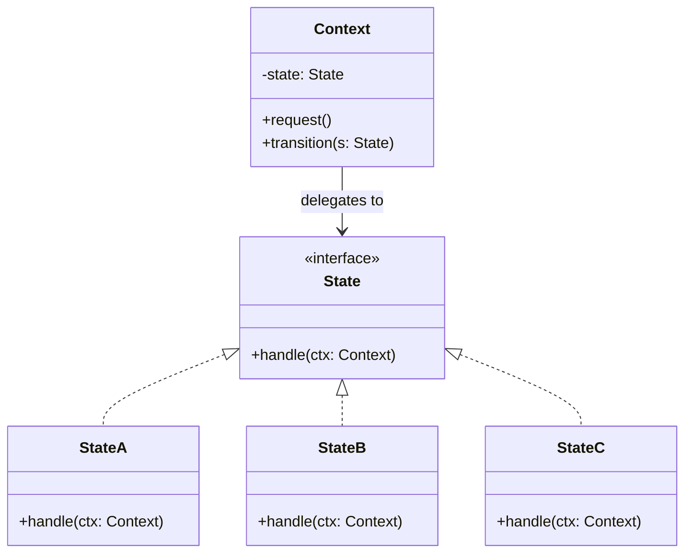

#programming #patterns #behavioral-patterns

# State Pattern: Changing Behavior with Internal State

## Definition

The State pattern allows an object to alter its behavior when its internal state changes, as if the object changed its class. Each state is represented by a separate type that implements a shared interface, and the context delegates behavior to the current state object.

This eliminates large `match` or `if`-chains that branch on an enum, replacing them with polymorphic dispatch.

> [!info] State vs Strategy
> State and Strategy are structurally identical — both delegate to an interchangeable object behind an interface. The difference is *intent*: Strategy swaps algorithms chosen by the caller, while State swaps behavior driven by internal transitions that the states themselves control.

## Diagram



## Example

```rust
trait State {
    fn handle(self: Box<Self>, doc: &mut DocumentContext) -> Box<dyn State>;
    fn status(&self) -> &str;
}

struct DocumentContext {
    state: Option<Box<dyn State>>,
    content: String,
}

impl DocumentContext {
    fn new() -> Self {
        Self {
            state: Some(Box::new(Draft)),
            content: String::new(),
        }
    }

    fn status(&self) -> &str {
        self.state.as_ref().unwrap().status()
    }

    fn publish(&mut self) {
        if let Some(state) = self.state.take() {
            self.state = Some(state.handle(self));
        }
    }
}

// --- States ---

struct Draft;

impl State for Draft {
    fn handle(self: Box<Self>, _doc: &mut DocumentContext) -> Box<dyn State> {
        println!("Draft → Review: submitting for review");
        Box::new(Review)
    }

    fn status(&self) -> &str {
        "Draft"
    }
}

struct Review;

impl State for Review {
    fn handle(self: Box<Self>, _doc: &mut DocumentContext) -> Box<dyn State> {
        println!("Review → Published: approved");
        Box::new(Published)
    }

    fn status(&self) -> &str {
        "Review"
    }
}

struct Published;

impl State for Published {
    fn handle(self: Box<Self>, _doc: &mut DocumentContext) -> Box<dyn State> {
        println!("Published: already published, no transition");
        Box::new(Published)
    }

    fn status(&self) -> &str {
        "Published"
    }
}

fn main() {
    let mut doc = DocumentContext::new();

    println!("Status: {}", doc.status()); // Draft
    doc.publish();
    println!("Status: {}", doc.status()); // Review
    doc.publish();
    println!("Status: {}", doc.status()); // Published
    doc.publish();                         // no-op
}
```

## Trade-offs

### Pros
- Each state encapsulates its own behavior — adding a new state does not affect existing ones (OCP).
- Eliminates complex conditional logic scattered across methods.
- Transitions are explicit and localized within state implementations.

### Cons
- Increases the number of types — one per state.
- State transitions can be hard to trace when spread across many state objects.
- Sharing data between states requires careful design (passing context or using shared references).

## Why It Matters

### When it helps
- An object has clearly defined states with different behavior in each (document workflow, connection lifecycle, game entity AI).
- State-dependent conditionals appear in multiple methods and are growing unwieldy.
- You want compile-time or runtime guarantees that certain operations are only available in specific states.

### When not to use
- There are only two or three trivial states — a simple enum with `match` is more readable.
- State transitions are rare and the behavioral differences are minor.
- The "states" are really just configuration values, not distinct behavioral modes.

> [!tip] Rust Enum Alternative
> In Rust, a simple `enum` with `match` is often preferable to the full State pattern. Reserve the trait-object approach for cases where states are numerous, independently developed, or need to be extended without modifying existing code.
