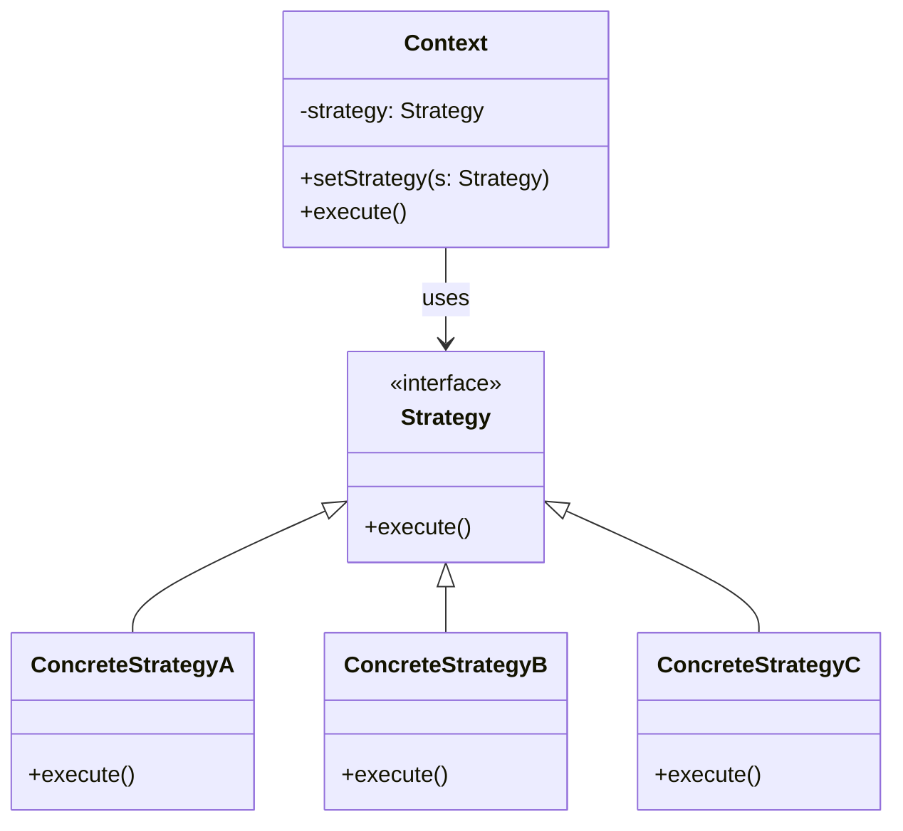

#programming #patterns #behavioral-patterns

# Strategy Pattern: Switching Behavior at Runtime

## Definition

The Strategy pattern encapsulates interchangeable algorithms behind a stable interface so the caller can choose behavior at runtime without branching.

## Diagram



## Example

> [!tip] Functional vs Trait-based
> In Rust, if your strategy is a single function with no state, use a plain `fn` pointer or closure (functional style). Reach for the trait-based approach when strategies carry configuration, need multiple methods, or require dynamic dispatch via `Box<dyn Strategy>`.

### Functional Style

```rust
fn addition_strategy(a: f64, b: f64) -> f64 {
    a + b
}

fn subtraction_strategy(a: f64, b: f64) -> f64 {
    a - b
}

fn division_strategy(a: f64, b: f64) -> f64 {
    if b == 0.0 {
        panic!("Division by zero is not allowed.");
    }
    a / b
}

// Higher-order function executes the chosen algorithm
fn execute_strategy(strategy: fn(f64, f64) -> f64, a: f64, b: f64) -> f64 {
    strategy(a, b)
}

fn main() {
    execute_strategy(addition_strategy, 10.0, 5.0);    // 15.0
    execute_strategy(subtraction_strategy, 10.0, 5.0);  // 5.0
    execute_strategy(division_strategy, 10.0, 5.0);     // 2.0
}
```

### Trait-based Style

```rust
trait Strategy {
    fn execute(&self, a: f64, b: f64) -> f64;
}

struct AdditionStrategy;
impl Strategy for AdditionStrategy {
    fn execute(&self, a: f64, b: f64) -> f64 {
        a + b
    }
}

struct SubtractionStrategy;
impl Strategy for SubtractionStrategy {
    fn execute(&self, a: f64, b: f64) -> f64 {
        a - b
    }
}

struct DivisionStrategy;
impl Strategy for DivisionStrategy {
    fn execute(&self, a: f64, b: f64) -> f64 {
        if b == 0.0 {
            panic!("Division by zero is not allowed.");
        }
        a / b
    }
}

struct Calculator {
    strategy: Box<dyn Strategy>,
}

impl Calculator {
    fn new(strategy: Box<dyn Strategy>) -> Self {
        Self { strategy }
    }

    fn execute(&self, a: f64, b: f64) -> f64 {
        self.strategy.execute(a, b)
    }
}

fn main() {
    let calc = Calculator::new(Box::new(AdditionStrategy));
    calc.execute(10.0, 5.0); // 15.0

    let calc = Calculator::new(Box::new(SubtractionStrategy));
    calc.execute(10.0, 5.0); // 5.0

    let calc = Calculator::new(Box::new(DivisionStrategy));
    calc.execute(10.0, 5.0); // 2.0
}
```

## Trade-offs

### Pros
- Easy to extend without touching existing code (OCP).
- Promotes clear separation of concerns.
- Enables runtime flexibility and testing of behaviors.

### Cons
- Adds boilerplate and extra indirection.
- Harder to manage shared state between strategies.
- Requires naming discipline to keep behaviors discoverable.

## Why It Matters

### When it helps
- You have several variations of an algorithm and the caller should not know the implementation details.
- You want to add new behaviors without modifying existing code (Open/Closed Principle).
- You need to tune behavior per environment (e.g., different pricing or sorting logic).

### When not to use
- The algorithms share too much mutable state (it leads to tight coupling).
- There are only two or three trivial behaviors that don't justify abstraction.
- You just need configuration, not polymorphism.

> [!warning] Over-abstraction
> The Strategy pattern is one of the most over-applied patterns. If you only have two behaviors and they never change, a simple `if`/`else` is clearer than introducing a trait, multiple structs, and dynamic dispatch.
