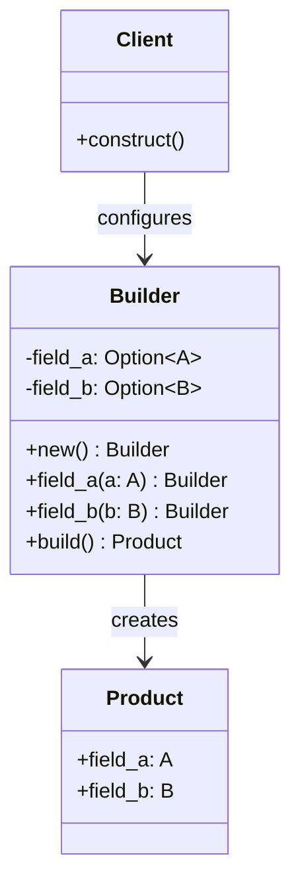

#programming #patterns #creational-patterns

# Builder Pattern: Constructing Complex Objects Step by Step

## Definition

The Builder pattern separates the construction of a complex object from its representation, allowing the same construction process to produce different configurations. Instead of a constructor with many parameters, the caller chains named methods that each set one aspect, then finalizes the object in a single build step.

In Rust the pattern is especially common because the language has no default parameter values and no function overloading — the builder fills that gap ergonomically.

> [!info] Why Builders Are Everywhere in Rust
> Languages like Python or C++ can use default arguments and overloads to handle optional configuration. Rust has neither, so the builder pattern becomes the idiomatic way to provide flexible, readable construction with defaults.

## Diagram



## Example

### Consuming builder (moves self)

```rust
struct HttpRequest {
    method: String,
    url: String,
    headers: Vec<(String, String)>,
    body: Option<String>,
}

struct RequestBuilder {
    method: String,
    url: String,
    headers: Vec<(String, String)>,
    body: Option<String>,
}

impl RequestBuilder {
    fn new(method: &str, url: &str) -> Self {
        Self {
            method: method.into(),
            url: url.into(),
            headers: Vec::new(),
            body: None,
        }
    }

    fn header(mut self, key: &str, value: &str) -> Self {
        self.headers.push((key.into(), value.into()));
        self
    }

    fn body(mut self, body: &str) -> Self {
        self.body = Some(body.into());
        self
    }

    fn build(self) -> HttpRequest {
        HttpRequest {
            method: self.method,
            url: self.url,
            headers: self.headers,
            body: self.body,
        }
    }
}

fn main() {
    let req = RequestBuilder::new("POST", "https://api.example.com/users")
        .header("Content-Type", "application/json")
        .header("Authorization", "Bearer tok_abc")
        .body(r#"{"name": "Alice"}"#)
        .build();

    println!("{} {} ({} headers)", req.method, req.url, req.headers.len());
}
```

### With validation on build

```rust
struct ConnectionPool {
    host: String,
    port: u16,
    max_size: u32,
    timeout_ms: u64,
}

struct PoolBuilder {
    host: Option<String>,
    port: u16,
    max_size: u32,
    timeout_ms: u64,
}

impl PoolBuilder {
    fn new() -> Self {
        Self {
            host: None,
            port: 5432,
            max_size: 10,
            timeout_ms: 3000,
        }
    }

    fn host(mut self, host: &str) -> Self {
        self.host = Some(host.into());
        self
    }

    fn port(mut self, port: u16) -> Self {
        self.port = port;
        self
    }

    fn max_size(mut self, n: u32) -> Self {
        self.max_size = n;
        self
    }

    fn timeout_ms(mut self, ms: u64) -> Self {
        self.timeout_ms = ms;
        self
    }

    fn build(self) -> Result<ConnectionPool, String> {
        let host = self.host.ok_or("host is required")?;
        if self.max_size == 0 {
            return Err("max_size must be > 0".into());
        }
        Ok(ConnectionPool {
            host,
            port: self.port,
            max_size: self.max_size,
            timeout_ms: self.timeout_ms,
        })
    }
}

fn main() {
    let pool = PoolBuilder::new()
        .host("db.example.com")
        .max_size(20)
        .timeout_ms(5000)
        .build()
        .expect("invalid config");

    println!("{}:{} pool({})", pool.host, pool.port, pool.max_size);
}
```

## Trade-offs

### Pros
- Makes construction readable — each setter documents its purpose by name.
- Supports optional fields and sensible defaults without parameter overloading.
- Validation can happen once at build time, guaranteeing the product is always valid.
- Works well with method chaining, producing a fluent API.

### Cons
- More boilerplate than a simple struct literal (Rust already has named fields).
- Duplicates field definitions between builder and product.
- Runtime errors on `build()` if required fields are missing (unless type-state is used).

> [!tip] Type-State Builders
> You can use generic type parameters to encode which fields have been set, making the `build()` method only available when all required fields are present. This moves missing-field errors from runtime to compile time.

## Why It Matters

### When it helps
- The object has many optional parameters or configuration combinations.
- Construction requires validation or multi-step setup that should not leak into the caller.
- You want a fluent, self-documenting API for complex initialization.

### When not to use
- The struct has few fields and no optional configuration — a plain constructor or struct literal is simpler.
- All fields are mandatory and there is no validation logic — the builder adds indirection without value.

> [!warning] Don't Wrap a Struct Literal
> If your struct has 2-3 mandatory fields and no defaults or validation, a builder just adds boilerplate around what a plain struct literal already does clearly. Reach for the pattern when complexity justifies it.
