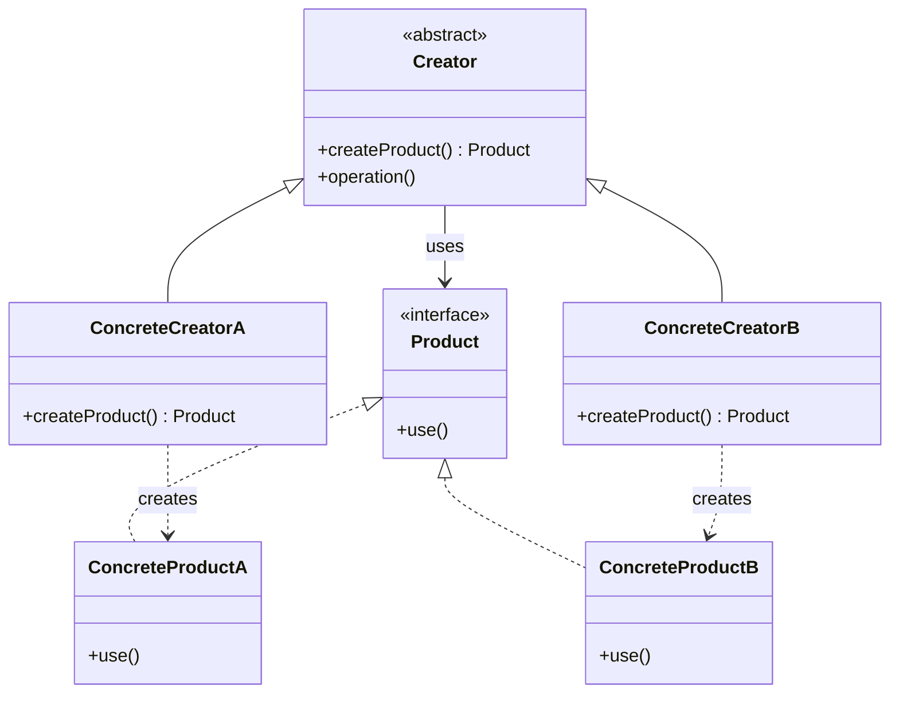
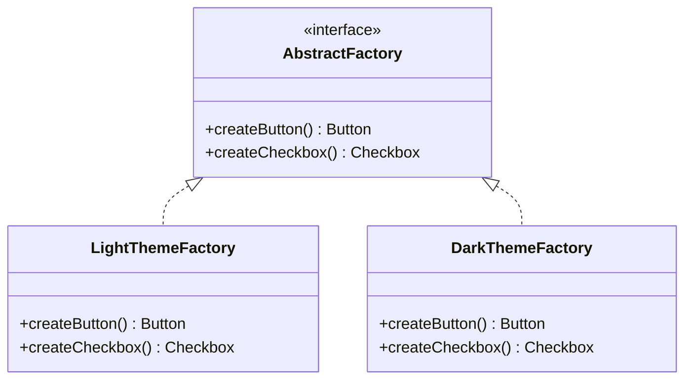

#programming #patterns #creational-patterns

# Factory Pattern: Delegating Object Creation

## Definition

The Factory pattern encapsulates object creation behind a dedicated function or method, so the caller specifies **what** to create without knowing **how** it is constructed. The creation logic lives in one place and can change independently of the code that uses the objects.

There are three common variants:

- **Simple Factory** — a function that returns different types based on an argument.
- **Factory Method** — a method defined in a base trait, overridden by implementors to create different products.
- **Abstract Factory** — a trait for creating families of related objects without specifying concrete types.

> [!note] Choosing the Right Variant
> Use a **Simple Factory** when you just need a creation function. Upgrade to **Factory Method** when subclasses should control which product is created. Reserve **Abstract Factory** for when you need to produce families of related objects that must stay consistent (e.g., a UI theme where buttons and checkboxes must match).

## Diagram

### Factory Method



### Abstract Factory



## Example

### Simple Factory

```rust
trait Logger {
    fn log(&self, message: &str);
}

struct ConsoleLogger;
impl Logger for ConsoleLogger {
    fn log(&self, message: &str) {
        println!("[console] {}", message);
    }
}

struct FileLogger;
impl Logger for FileLogger {
    fn log(&self, message: &str) {
        // write to file
        println!("[file] {}", message);
    }
}

struct RemoteLogger;
impl Logger for RemoteLogger {
    fn log(&self, message: &str) {
        // send to logging service
        println!("[remote] {}", message);
    }
}

fn create_logger(log_type: &str) -> Box<dyn Logger> {
    match log_type {
        "file"   => Box::new(FileLogger),
        "remote" => Box::new(RemoteLogger),
        _        => Box::new(ConsoleLogger),
    }
}

fn main() {
    let logger = create_logger("console");
    logger.log("Application started");
}
```

### Factory Method

```rust
trait NotificationChannel {
    fn deliver(&self, message: &str);
}

trait Notification {
    fn create_channel(&self) -> Box<dyn NotificationChannel>;

    fn send(&self, message: &str) {
        let channel = self.create_channel();
        channel.deliver(message);
    }
}

// --- Email ---

struct EmailChannel;
impl NotificationChannel for EmailChannel {
    fn deliver(&self, message: &str) {
        println!("Email: {}", message);
    }
}

struct EmailNotification;
impl Notification for EmailNotification {
    fn create_channel(&self) -> Box<dyn NotificationChannel> {
        Box::new(EmailChannel)
    }
}

// --- SMS ---

struct SmsChannel;
impl NotificationChannel for SmsChannel {
    fn deliver(&self, message: &str) {
        println!("SMS: {}", message);
    }
}

struct SmsNotification;
impl Notification for SmsNotification {
    fn create_channel(&self) -> Box<dyn NotificationChannel> {
        Box::new(SmsChannel)
    }
}

// Caller doesn't know which channel is used
fn notify(notification: &dyn Notification, message: &str) {
    notification.send(message);
}

fn main() {
    notify(&EmailNotification, "Your order shipped");
    notify(&SmsNotification, "Your code is 4821");
}
```

### Functional Style

```rust
fn create_serializer(format: &str) -> Box<dyn Fn(&[(&str, &str)]) -> String> {
    match format {
        "csv" => Box::new(|data| {
            data.iter().map(|(_, v)| *v).collect::<Vec<_>>().join(",")
        }),
        "xml" => Box::new(|data| {
            let inner: String = data
                .iter()
                .map(|(k, v)| format!("<{k}>{v}</{k}>"))
                .collect();
            format!("<data>{inner}</data>")
        }),
        _ => Box::new(|data| {
            let pairs: String = data
                .iter()
                .map(|(k, v)| format!("\"{k}\":\"{v}\""))
                .collect::<Vec<_>>()
                .join(",");
            format!("{{{pairs}}}")
        }),
    }
}

fn main() {
    let to_json = create_serializer("json");
    let to_csv = create_serializer("csv");

    let data = &[("name", "Alice"), ("age", "30")];

    println!("{}", to_json(data)); // {"name":"Alice","age":"30"}
    println!("{}", to_csv(data));  // Alice,30
}
```

## Trade-offs

### Pros
- Centralizes creation logic — changes to instantiation happen in one place.
- Decouples callers from concrete types (Dependency Inversion).
- Makes it easy to introduce new variants without modifying existing code (OCP).
- Simplifies testing — factories can return mocks or stubs.

> [!tip] Testability
> Factories shine in testing. By swapping the factory, you can inject mock implementations without changing any calling code. This is especially powerful when combined with dependency injection.

### Cons
- Adds indirection — more types and files to navigate.
- Can be over-applied to trivial cases where a simple constructor suffices.
- Abstract Factory in particular can lead to an explosion of traits.

## Why It Matters

### When it helps
- Object creation involves conditional logic, configuration, or setup steps.
- You need to swap implementations at runtime or across environments (dev/staging/prod).
- Multiple types share a trait and the caller shouldn't choose the concrete type.

### When not to use
- There is only one implementation and no foreseeable need for alternatives.
- Construction is trivial — a factory would add complexity without value.
- You are wrapping a single constructor with nothing else — that is not a factory, it is a wrapper.

> [!warning] Over-Engineering Alert
> A function that wraps a single constructor with no branching logic is not a factory — it is unnecessary indirection. The pattern earns its keep only when creation involves decisions, configuration, or multiple possible types.
