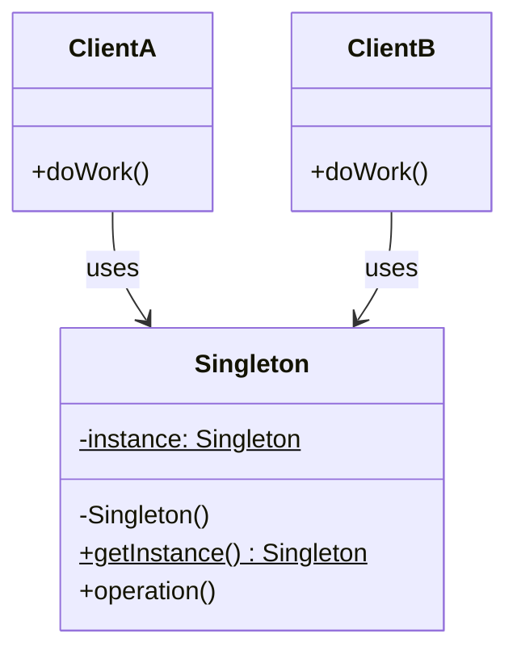

#programming #patterns #creational-patterns

# Singleton Pattern: One Instance to Rule Them All

## Definition

The Singleton pattern ensures a class has exactly one instance and provides a global point of access to it. The single instance is created lazily (on first use) or eagerly (at startup) and reused for the lifetime of the application.

It is most often applied to shared resources — configuration, logging, connection pools — where multiple instances would cause conflicts or waste.

## Diagram



## Example

### Thread-safe with `std::sync::OnceLock`

```rust
use std::sync::OnceLock;

struct Config {
    db_url: String,
    max_connections: u32,
}

impl Config {
    fn global() -> &'static Config {
        static INSTANCE: OnceLock<Config> = OnceLock::new();
        INSTANCE.get_or_init(|| Config {
            db_url: "postgres://localhost/mydb".into(),
            max_connections: 10,
        })
    }
}

fn main() {
    let cfg = Config::global();
    println!("DB: {}, max: {}", cfg.db_url, cfg.max_connections);

    // Same instance every time
    let cfg2 = Config::global();
    assert!(std::ptr::eq(cfg, cfg2));
}
```

### With interior mutability

```rust
use std::sync::{Mutex, OnceLock};

struct Logger {
    entries: Mutex<Vec<String>>,
}

impl Logger {
    fn global() -> &'static Logger {
        static INSTANCE: OnceLock<Logger> = OnceLock::new();
        INSTANCE.get_or_init(|| Logger {
            entries: Mutex::new(Vec::new()),
        })
    }

    fn log(&self, message: &str) {
        let mut entries = self.entries.lock().expect("lock poisoned");
        entries.push(message.to_string());
        println!("[LOG] {}", message);
    }

    fn dump(&self) -> Vec<String> {
        self.entries.lock().expect("lock poisoned").clone()
    }
}

fn main() {
    Logger::global().log("Application started");
    Logger::global().log("Processing request");

    let all = Logger::global().dump();
    println!("Total entries: {}", all.len()); // 2
}
```

## Trade-offs

### Pros
- Guarantees a single shared instance — avoids resource duplication.
- Lazy initialization defers work until the value is actually needed.
- `OnceLock` makes it thread-safe without external crates.

### Cons
- Global mutable state complicates testing and reasoning about side effects.
- Hides dependencies — callers reach for a global instead of receiving an explicit parameter.

> [!danger] Hidden Dependencies
> When functions call `Config::global()` or `Logger::global()` internally, their signatures no longer reveal what they depend on. This makes code harder to reason about, refactor, and test. Prefer explicit parameters when possible.
- Lifetime is `'static`, making cleanup or reconfiguration difficult.
- Often overused — many "singletons" are really just values that should be passed around.

> [!warning] The Most Overused Pattern
> Ask yourself: does this *truly* need to be a singleton, or is it just convenient? If you can pass it as a parameter without pain, do that instead. Singletons should be a last resort for genuinely global, shared resources.

## Why It Matters

### When it helps
- A resource is expensive to create and must be shared (database pool, HTTP client).
- Exactly one coordinator is required (event bus, global configuration).
- You need lazy, thread-safe initialization with no external dependencies.

### When not to use
- You can pass the value through function parameters or dependency injection instead.
- The "single instance" requirement is artificial — most services work fine with multiple instances.
- You need different configurations in tests — singletons make per-test isolation harder.

> [!tip] Alternative in Rust
> Consider using `OnceLock` at the application entry point to initialize a value, then pass `&'static` references through your call stack. You get the same lazy initialization and `'static` lifetime without hiding the dependency behind a global accessor.
