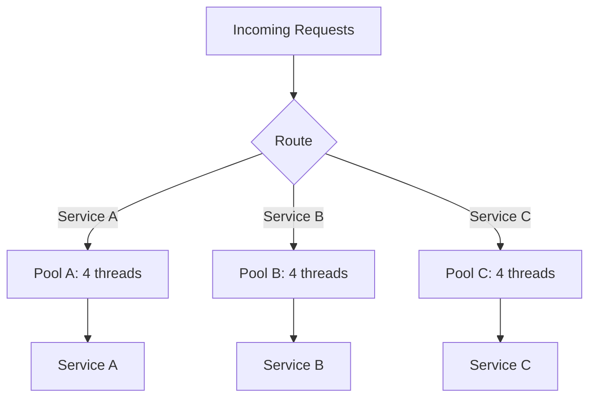

#programming #patterns #resilience-patterns

# Bulkhead Pattern: Isolating Failures Through Resource Partitioning

## Definition

The Bulkhead pattern isolates components or resources into independent compartments so that a failure in one does not cascade to others. Named after the watertight compartments in a ship's hull, it ensures that a flood (resource exhaustion, deadlock, or crash) in one section does not sink the entire vessel.

In practice this means assigning dedicated thread pools, connection pools, or rate limits to different services or workloads, preventing one slow consumer from starving the rest.

> [!tip] Ship Hull Analogy
> Each bulkhead is a self-contained compartment. If one compartment floods (a dependency becomes slow or unresponsive), the others remain fully operational. Size each pool based on the downstream service's expected latency and throughput.

## Diagram



## Example

```rust
use std::sync::mpsc;
use std::thread;
use std::time::Duration;

struct Bulkhead {
    name: String,
    sender: mpsc::SyncSender<Box<dyn FnOnce() + Send>>,
}

impl Bulkhead {
    /// Creates a bulkhead with a fixed number of worker threads
    /// and a bounded task queue.
    fn new(name: &str, workers: usize, queue_size: usize) -> Self {
        let (tx, rx) = mpsc::sync_channel::<Box<dyn FnOnce() + Send>>(queue_size);
        let rx = std::sync::Arc::new(std::sync::Mutex::new(rx));

        for worker_id in 0..workers {
            let rx = rx.clone();
            let pool_name = name.to_string();
            thread::spawn(move || {
                loop {
                    let task = {
                        let lock = rx.lock().expect("mutex poisoned");
                        lock.recv()
                    };
                    match task {
                        Ok(f) => {
                            println!("[{}/w{}] executing task", pool_name, worker_id);
                            f();
                        }
                        Err(_) => break, // channel closed
                    }
                }
            });
        }

        Self {
            name: name.to_string(),
            sender: tx,
        }
    }

    /// Submits work to this bulkhead. Returns Err if the queue is full.
    fn submit<F: FnOnce() + Send + 'static>(&self, task: F) -> Result<(), String> {
        self.sender
            .try_send(Box::new(task))
            .map_err(|_| format!("[{}] queue full — rejected", self.name))
    }
}

fn main() {
    // Separate bulkheads for different services
    let orders = Bulkhead::new("orders", 2, 4);
    let payments = Bulkhead::new("payments", 2, 4);

    // Simulate: payments service is slow
    for i in 0..3 {
        let _ = payments.submit(move || {
            println!("  Payment {} — slow processing", i);
            thread::sleep(Duration::from_millis(500));
        });
    }

    // Orders service is unaffected — it has its own pool
    for i in 0..3 {
        let _ = orders.submit(move || {
            println!("  Order {} — fast processing", i);
            thread::sleep(Duration::from_millis(50));
        });
    }

    // Give threads time to finish
    thread::sleep(Duration::from_secs(2));
}
```

## Trade-offs

### Pros
- Fault isolation — one exhausted pool cannot starve others.
- Predictable resource allocation — each service gets guaranteed capacity.
- Works well with [[Circuit Breaker]] and [[Retry]] for layered resilience.

### Cons
- Overall resource utilization is lower — idle capacity in one pool cannot help another.
- More pools to configure, monitor, and size correctly.
- Adds complexity to the deployment and operational model.

> [!warning] Pool Sizing
> Under-provisioned pools reject legitimate requests; over-provisioned pools waste memory and threads. Monitor queue depths and rejection rates to tune pool sizes over time.

## Why It Matters

### When it helps
- A system calls multiple external services and a slowdown in one must not degrade the others.
- Different workloads have different SLAs (critical vs. best-effort) and should not compete for resources.
- You need to enforce limits on concurrent access to a shared resource (database connections, file handles).

### When not to use
- The application calls a single external service — there is nothing to isolate from.
- Resources are scarce and partitioning would leave every pool undersized.
- The workloads are inherently coupled and must share state — isolation would require expensive synchronization.

> [!info] Combining Patterns
> Bulkhead isolates *where* failures happen. Pair it with [[Circuit Breaker]] to control *when* to stop calling a failing service, and [[Retry]] to handle *transient* failures within each compartment.
