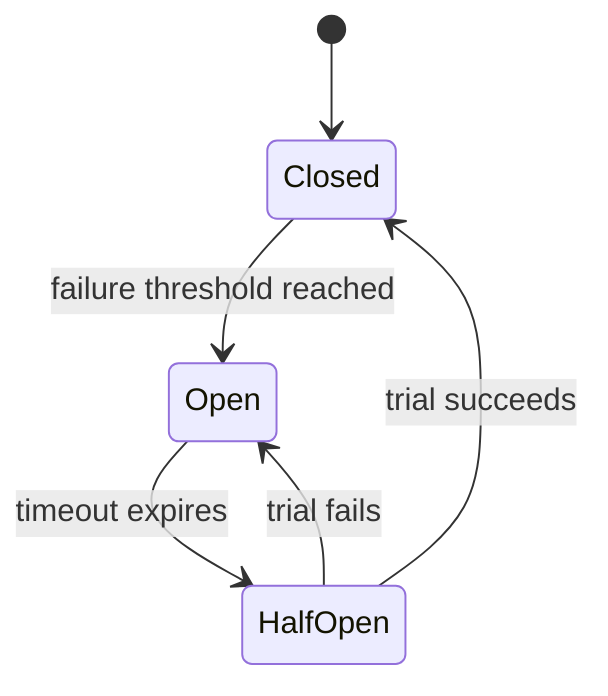

#programming #patterns #resilience-patterns

# Circuit Breaker: Failing Fast When a Dependency Is Down

## Definition

The Circuit Breaker pattern prevents an application from repeatedly calling a failing external service. It wraps calls in a state machine with three states:

- **Closed** — requests flow normally. Failures are counted.
- **Open** — requests are rejected immediately without calling the service. A timeout determines how long to wait before retrying.
- **Half-Open** — a single trial request is allowed. If it succeeds, the breaker returns to Closed. If it fails, it returns to Open.

This protects the caller from wasting resources on a service that is likely down and gives the failing service time to recover.

> [!info] Key Distinction
> The circuit breaker does not *fix* the downstream failure. It protects your system from collateral damage while the dependency recovers on its own.

## Diagram



## Example

```rust
use std::time::{Duration, Instant};

#[derive(Debug, Clone, Copy, PartialEq)]
enum BreakerState {
    Closed,
    Open,
    HalfOpen,
}

struct CircuitBreaker {
    state: BreakerState,
    failure_count: u32,
    failure_threshold: u32,
    open_since: Option<Instant>,
    recovery_timeout: Duration,
}

impl CircuitBreaker {
    fn new(failure_threshold: u32, recovery_timeout: Duration) -> Self {
        Self {
            state: BreakerState::Closed,
            failure_count: 0,
            failure_threshold,
            open_since: None,
            recovery_timeout,
        }
    }

    fn call<F, T, E>(&mut self, operation: F) -> Result<T, String>
    where
        F: FnOnce() -> Result<T, E>,
        E: std::fmt::Display,
    {
        match self.state {
            BreakerState::Open => {
                if self.open_since.unwrap().elapsed() >= self.recovery_timeout {
                    self.state = BreakerState::HalfOpen;
                    println!("[Breaker] Open → HalfOpen (attempting trial)");
                } else {
                    return Err("Circuit is OPEN — call rejected".into());
                }
            }
            _ => {}
        }

        match operation() {
            Ok(value) => {
                if self.state == BreakerState::HalfOpen {
                    println!("[Breaker] HalfOpen → Closed (trial succeeded)");
                }
                self.state = BreakerState::Closed;
                self.failure_count = 0;
                Ok(value)
            }
            Err(e) => {
                self.failure_count += 1;
                println!(
                    "[Breaker] Failure {}/{}: {}",
                    self.failure_count, self.failure_threshold, e
                );

                if self.failure_count >= self.failure_threshold {
                    self.state = BreakerState::Open;
                    self.open_since = Some(Instant::now());
                    println!("[Breaker] → Open");
                }

                Err(format!("Operation failed: {}", e))
            }
        }
    }
}

// Simulated external service
fn call_payment_service(should_fail: bool) -> Result<String, String> {
    if should_fail {
        Err("connection timeout".into())
    } else {
        Ok("payment processed".into())
    }
}

fn main() {
    let mut breaker = CircuitBreaker::new(3, Duration::from_secs(2));

    // Simulate failures
    for _ in 0..4 {
        let _ = breaker.call(|| call_payment_service(true));
    }

    // Circuit is now open — calls are rejected without hitting the service
    let result = breaker.call(|| call_payment_service(false));
    println!("Rejected: {:?}", result);

    // After recovery timeout, circuit moves to half-open and allows a trial
    std::thread::sleep(Duration::from_secs(2));
    let result = breaker.call(|| call_payment_service(false));
    println!("Recovered: {:?}", result);
}
```

## Trade-offs

### Pros
- Prevents cascading failures by stopping calls to an unresponsive service.
- Gives the failing service time to recover instead of being hammered with retries.
- Fails fast — callers get an immediate error instead of waiting for a timeout.

### Cons
- Adds complexity — another stateful component to configure and monitor.
- Threshold tuning is critical — too sensitive triggers false opens, too lenient delays protection.
- Does not fix the underlying failure — it is a damage-control mechanism, not a solution.

> [!warning] Threshold Tuning
> Start with conservative thresholds (e.g., 5 failures in 60 seconds) and adjust based on observed error rates. A breaker that trips too easily causes more outages than it prevents.

## Why It Matters

### When it helps
- Calling external services (payment gateways, third-party APIs, databases) that may become temporarily unavailable.
- Microservice architectures where one failing service can bring down the entire system.
- Combined with [[Retry]] and [[Bulkhead]] for a comprehensive resilience strategy.

### When not to use
- The dependency is local and in-process — failures should be handled directly.
- The operation is idempotent and cheap enough that retrying immediately is acceptable.
- There is only one consumer and the service has no recovery semantics.

> [!tip] Half-Open Is the Recovery Gate
> The Half-Open state is what makes this pattern self-healing. Without it, you would need manual intervention to re-enable calls after an outage.
