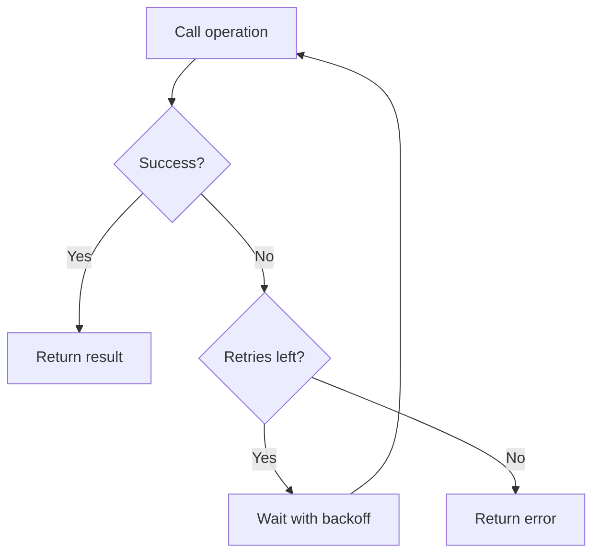

#programming #patterns #resilience-patterns

# Retry Pattern: Recovering from Transient Failures

## Definition

The Retry pattern automatically re-executes a failed operation on the assumption that the failure is transient — network glitches, brief service outages, or temporary resource contention. Each attempt is separated by a delay that typically increases with each retry (**exponential backoff**), optionally combined with **jitter** to prevent synchronized retry storms.

> [!danger] Never Retry Non-Idempotent Operations
> Retrying a payment, order submission, or any write that lacks deduplication can cause duplicates or data corruption. Only retry operations that are safe to repeat.

## Diagram



## Example

```rust
use std::time::Duration;
use std::thread;

#[derive(Debug)]
struct RetryConfig {
    max_attempts: u32,
    base_delay: Duration,
    max_delay: Duration,
}

impl RetryConfig {
    fn new(max_attempts: u32, base_delay: Duration, max_delay: Duration) -> Self {
        Self {
            max_attempts,
            base_delay,
            max_delay,
        }
    }
}

fn retry<F, T, E>(config: &RetryConfig, operation: F) -> Result<T, E>
where
    F: Fn() -> Result<T, E>,
    E: std::fmt::Display,
{
    let mut attempt = 0;

    loop {
        attempt += 1;
        match operation() {
            Ok(value) => return Ok(value),
            Err(e) => {
                if attempt >= config.max_attempts {
                    println!(
                        "[Retry] All {} attempts exhausted, giving up",
                        config.max_attempts
                    );
                    return Err(e);
                }

                // Exponential backoff: base * 2^(attempt-1), capped at max
                let delay = config
                    .base_delay
                    .mul_f64(2_f64.powi(attempt as i32 - 1))
                    .min(config.max_delay);

                println!(
                    "[Retry] Attempt {}/{} failed: {}. Waiting {:?}",
                    attempt, config.max_attempts, e, delay
                );

                thread::sleep(delay);
            }
        }
    }
}

// Simulated flaky service
fn flaky_api_call() -> Result<String, String> {
    use std::sync::atomic::{AtomicU32, Ordering};
    static CALLS: AtomicU32 = AtomicU32::new(0);

    let n = CALLS.fetch_add(1, Ordering::SeqCst);
    if n < 2 {
        Err("503 Service Unavailable".into())
    } else {
        Ok("200 OK — data retrieved".into())
    }
}

fn main() {
    let config = RetryConfig::new(5, Duration::from_millis(100), Duration::from_secs(2));

    match retry(&config, flaky_api_call) {
        Ok(result) => println!("[Success] {}", result),
        Err(e) => println!("[Failed] {}", e),
    }
}
```

## Trade-offs

### Pros
- Handles transient failures transparently — callers do not need manual retry logic.
- Exponential backoff reduces pressure on a struggling service.
- Simple to implement and compose with other resilience patterns ([[Circuit Breaker]], [[Bulkhead]]).

### Cons
- Increases overall latency — each retry adds delay.
- Can make things worse if the failure is permanent (retries waste resources).
- Without jitter, synchronized retries from many clients can create thundering herd effects.

> [!warning] Jitter Prevents Thundering Herds
> Always add random jitter to backoff delays. Without it, clients that failed at the same time will retry at the same time, repeatedly overwhelming the recovering service.

## Why It Matters

### When it helps
- Network calls to external services that experience occasional timeouts or 5xx errors.
- Database connections that fail under brief load spikes.
- Any operation where transient failures are expected and the operation is safe to repeat.

### When not to use
- The operation is not idempotent — retrying a non-idempotent write can cause duplicates or corruption.
- The failure is deterministic (400 Bad Request, validation error) — retrying will never succeed.
- The service is known to be down for an extended period — use a [[Circuit Breaker]] to fail fast instead.

> [!tip] Classify Errors Before Retrying
> Distinguish between retryable errors (5xx, timeouts, connection resets) and non-retryable errors (4xx, auth failures). Retrying a `400 Bad Request` wastes time and resources.
