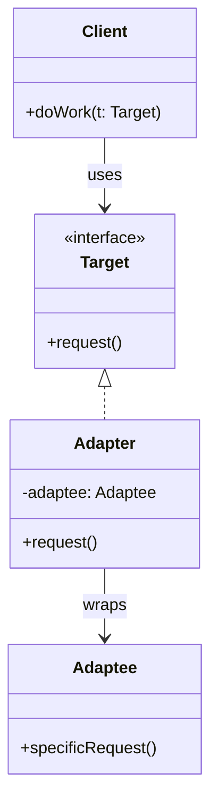

#programming #patterns #structural-patterns

# Adapter Pattern: Bridging Incompatible Interfaces

## Definition

The Adapter pattern converts the interface of an existing type into the interface a client expects. It lets classes work together that otherwise could not because of incompatible APIs — without modifying either side.

In Rust the adapter is typically a thin wrapper struct that implements the target trait by delegating to the adaptee's methods, translating arguments and return types as needed.

> [!tip] Adapter vs. Changing the Source
> If you control both sides of the interface mismatch, consider just changing one to match the other. The Adapter pattern earns its keep when at least one side is code you cannot — or should not — modify (third-party crates, stable public APIs, legacy systems).

## Diagram



## Example

```rust
// Legacy analytics library with its own interface
struct LegacyAnalytics;

impl LegacyAnalytics {
    fn track_event_v1(&self, category: &str, action: &str, label: &str) {
        println!("legacy track: {}/{}/{}", category, action, label);
    }
}

// The interface our application expects
trait Analytics {
    fn track(&self, event_name: &str, properties: &[(&str, &str)]);
}

// Modern analytics provider implements the trait directly
struct ModernAnalytics;

impl Analytics for ModernAnalytics {
    fn track(&self, event_name: &str, properties: &[(&str, &str)]) {
        let props: String = properties
            .iter()
            .map(|(k, v)| format!("{}={}", k, v))
            .collect::<Vec<_>>()
            .join(", ");
        println!("modern track: {} [{}]", event_name, props);
    }
}

// Adapter wraps the legacy library behind the new interface
struct LegacyAnalyticsAdapter {
    inner: LegacyAnalytics,
}

impl Analytics for LegacyAnalyticsAdapter {
    fn track(&self, event_name: &str, properties: &[(&str, &str)]) {
        let category = properties
            .iter()
            .find(|(k, _)| *k == "category")
            .map(|(_, v)| *v)
            .unwrap_or("general");

        let label = properties
            .iter()
            .find(|(k, _)| *k == "label")
            .map(|(_, v)| *v)
            .unwrap_or("");

        self.inner.track_event_v1(category, event_name, label);
    }
}

// Client code works with any Analytics implementation
fn record(analytics: &dyn Analytics) {
    analytics.track("page_view", &[("category", "nav"), ("label", "home")]);
}

fn main() {
    record(&ModernAnalytics);
    record(&LegacyAnalyticsAdapter {
        inner: LegacyAnalytics,
    });
}
```

## Trade-offs

### Pros
- Integrates legacy or third-party code without modifying it.
- Keeps client code decoupled from concrete implementations.
- Easy to swap adapters when the underlying library changes.

### Cons
- Adds a layer of indirection that can obscure the actual behavior.
- Translation between interfaces may lose precision or features.
- If many methods need adapting, the wrapper becomes verbose.

> [!warning] Lossy Adaptation
> When the adaptee's interface is richer than the target trait, the adapter must silently discard information. Document what gets lost — callers may depend on features the adapter quietly drops.

## Why It Matters

### When it helps
- You integrate a third-party library whose API does not match your domain trait.
- A legacy subsystem must conform to a new interface during a migration.
- You want to test against a trait but the real dependency has a different shape.

### When not to use
- The interfaces are already compatible — wrapping adds noise.
- You control both sides and can simply change one to match the other.
- The adaptation is so complex it becomes a rewrite rather than a thin translation.
