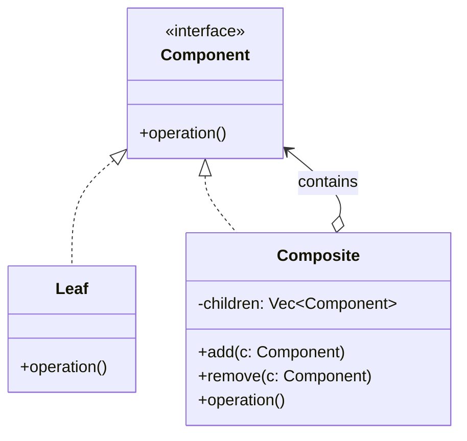

#programming #patterns #structural-patterns

# Composite Pattern: Treating Trees and Leaves Uniformly

## Definition

The Composite pattern composes objects into tree structures to represent part-whole hierarchies. It lets clients treat individual objects (leaves) and compositions of objects (branches) through the same interface, eliminating the need for type-checking at every level.

## Diagram



## Example

```rust
trait FileSystemEntry {
    fn name(&self) -> &str;
    fn size(&self) -> u64;
    fn display(&self, indent: usize);
}

// Leaf
struct File {
    name: String,
    size: u64,
}

impl FileSystemEntry for File {
    fn name(&self) -> &str {
        &self.name
    }

    fn size(&self) -> u64 {
        self.size
    }

    fn display(&self, indent: usize) {
        println!("{:indent$}{} ({}B)", "", self.name, self.size, indent = indent);
    }
}

// Composite
struct Directory {
    name: String,
    children: Vec<Box<dyn FileSystemEntry>>,
}

impl Directory {
    fn new(name: &str) -> Self {
        Self {
            name: name.into(),
            children: Vec::new(),
        }
    }

    fn add(&mut self, entry: Box<dyn FileSystemEntry>) {
        self.children.push(entry);
    }
}

impl FileSystemEntry for Directory {
    fn name(&self) -> &str {
        &self.name
    }

    fn size(&self) -> u64 {
        self.children.iter().map(|c| c.size()).sum()
    }

    fn display(&self, indent: usize) {
        println!("{:indent$}{}/", "", self.name, indent = indent);
        for child in &self.children {
            child.display(indent + 2);
        }
    }
}

fn main() {
    let mut root = Directory::new("project");

    let mut src = Directory::new("src");
    src.add(Box::new(File { name: "main.rs".into(), size: 1200 }));
    src.add(Box::new(File { name: "lib.rs".into(), size: 800 }));

    root.add(Box::new(src));
    root.add(Box::new(File { name: "Cargo.toml".into(), size: 350 }));

    root.display(0);
    println!("Total size: {}B", root.size());
}
```

## Trade-offs

### Pros
- Uniform treatment of leaves and composites simplifies client code.
- Easy to add new component types without changing existing traversal logic.
- Natural fit for any recursive, tree-shaped data (file systems, UI widgets, org charts).

### Cons
- Makes it harder to restrict which types can be children of a composite.
- Overly general interface may force leaves to implement methods that make no sense for them (e.g., `add`).
- Recursive structures can be harder to debug and reason about.

> [!warning] Leaky Abstractions on Leaves
> If your component trait includes mutation methods like `add` or `remove`, leaves must either panic or silently no-op. In Rust, prefer splitting the trait or using enums to make invalid operations unrepresentable at compile time.

## Why It Matters

### When it helps
- You model a hierarchy where operations should apply uniformly to both individual items and groups.
- Recursive traversal (size calculation, rendering, validation) should not care about depth.
- New node types are expected and the client code should remain unchanged.

> [!info] Rust Idiomatic Alternative
> In Rust, an `enum` with variants for leaf and composite often replaces the trait-based Composite pattern. This gives exhaustive `match` checking and avoids trait-object overhead, while preserving the same recursive structure.

### When not to use
- The structure is flat — a simple list or map is enough.
- Leaf and composite behaviors are fundamentally different and forcing a shared interface creates confusion.
- Performance-critical traversal where virtual dispatch overhead matters.
