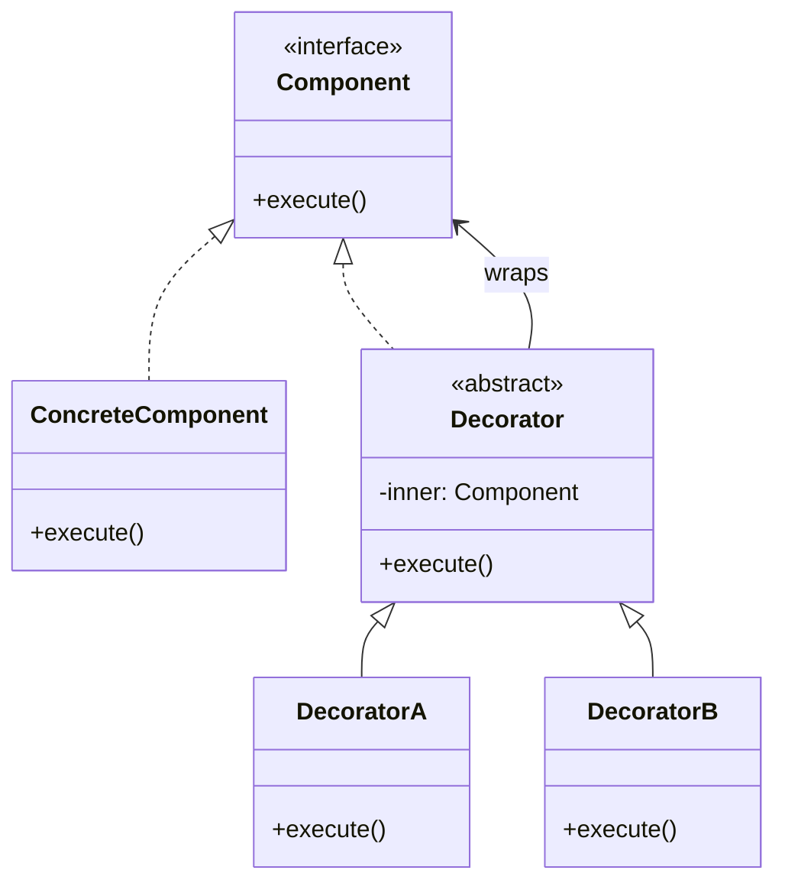

#programming #patterns #structural-patterns

# Decorator Pattern: Adding Behavior Without Subclassing

## Definition

The Decorator pattern attaches additional responsibilities to an object dynamically by wrapping it in another object that implements the same interface. Each decorator adds one concern — logging, caching, retrying — and delegates the rest to the inner object, enabling arbitrary composition at runtime.

## Diagram



## Example

```rust
trait Notifier {
    fn send(&self, message: &str);
}

// Base implementation
struct EmailNotifier {
    address: String,
}

impl Notifier for EmailNotifier {
    fn send(&self, message: &str) {
        println!("Email to {}: {}", self.address, message);
    }
}

// Decorator: adds Slack notification
struct SlackDecorator {
    inner: Box<dyn Notifier>,
    channel: String,
}

impl Notifier for SlackDecorator {
    fn send(&self, message: &str) {
        self.inner.send(message);
        println!("Slack #{}: {}", self.channel, message);
    }
}

// Decorator: adds SMS notification
struct SmsDecorator {
    inner: Box<dyn Notifier>,
    phone: String,
}

impl Notifier for SmsDecorator {
    fn send(&self, message: &str) {
        self.inner.send(message);
        println!("SMS to {}: {}", self.phone, message);
    }
}

// Decorator: adds logging
struct LoggingDecorator {
    inner: Box<dyn Notifier>,
}

impl Notifier for LoggingDecorator {
    fn send(&self, message: &str) {
        println!("[LOG] Sending notification: {}", message);
        self.inner.send(message);
    }
}

fn main() {
    // Compose: log → sms → slack → email
    let notifier: Box<dyn Notifier> = Box::new(LoggingDecorator {
        inner: Box::new(SmsDecorator {
            inner: Box::new(SlackDecorator {
                inner: Box::new(EmailNotifier {
                    address: "alice@example.com".into(),
                }),
                channel: "alerts".into(),
            }),
            phone: "+1234567890".into(),
        }),
    });

    notifier.send("Server is down");
}
```

## Trade-offs

### Pros
- Follows the Single Responsibility Principle — each decorator handles one concern.
- Behaviors compose at runtime without creating a subclass for every combination.
- Easy to add new decorators without modifying existing code (OCP).

### Cons
- Deep nesting can make debugging and stack traces harder to follow.
- Order of wrapping matters and can introduce subtle bugs.
- Many small objects increase allocation overhead.

> [!danger] Wrapping Order Matters
> `Logging(Caching(Service))` logs every call but caches results, while `Caching(Logging(Service))` caches results and only logs on cache misses. Always reason about the call chain from the outermost decorator inward.

## Why It Matters

### When it helps
- You need to layer cross-cutting concerns (logging, metrics, caching, auth) onto services.
- Combinations of behaviors are numerous and subclassing would lead to an explosion of types.
- Behavior must be added or removed at runtime based on configuration.

### When not to use
- Only one or two fixed combinations exist — direct composition or a simple wrapper is clearer.
- The interface is large — each decorator must forward many methods, creating boilerplate.
- Performance-critical paths where wrapping overhead is unacceptable.

> [!tip] Decorator vs. Middleware
> In web frameworks and async runtimes, the middleware/tower-layer pattern is essentially the Decorator pattern applied to `Service` traits. If you understand decorators, you already understand middleware stacks.
