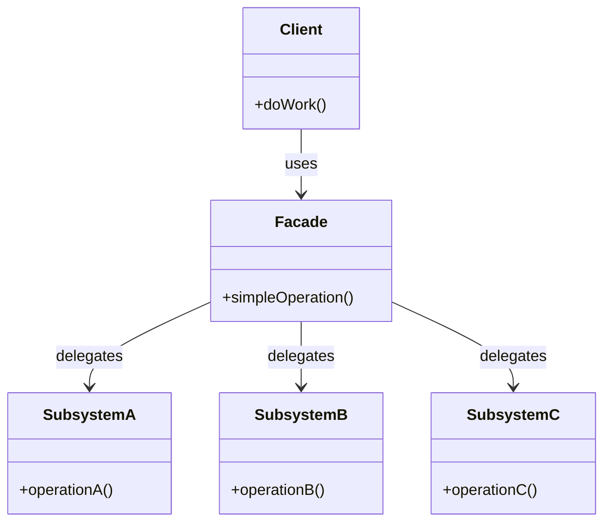

#programming #patterns #structural-patterns

# Facade Pattern: Simplifying a Complex Subsystem

## Definition

The Facade pattern provides a unified, higher-level interface to a set of interfaces in a subsystem. It does not add new functionality — it orchestrates existing components behind a single entry point, reducing the coupling between clients and the subsystem's internal complexity.

## Diagram



## Example

```rust
// --- Subsystem components ---

struct VideoDecoder;
impl VideoDecoder {
    fn decode(&self, file: &str) -> Vec<u8> {
        println!("Decoding video: {}", file);
        vec![0xDE, 0xAD] // raw frames
    }
}

struct AudioDecoder;
impl AudioDecoder {
    fn decode(&self, file: &str) -> Vec<u8> {
        println!("Decoding audio: {}", file);
        vec![0xBE, 0xEF] // raw samples
    }
}

struct SubtitleParser;
impl SubtitleParser {
    fn parse(&self, file: &str) -> Vec<String> {
        println!("Parsing subtitles: {}", file);
        vec!["Hello, world!".into()]
    }
}

struct Renderer;
impl Renderer {
    fn render(&self, video: &[u8], audio: &[u8], subtitles: &[String]) {
        println!(
            "Rendering {} video bytes, {} audio bytes, {} subtitle lines",
            video.len(),
            audio.len(),
            subtitles.len()
        );
    }
}

// --- Facade ---

struct MediaPlayer {
    video: VideoDecoder,
    audio: AudioDecoder,
    subs: SubtitleParser,
    renderer: Renderer,
}

impl MediaPlayer {
    fn new() -> Self {
        Self {
            video: VideoDecoder,
            audio: AudioDecoder,
            subs: SubtitleParser,
            renderer: Renderer,
        }
    }

    fn play(&self, file: &str) {
        let video_data = self.video.decode(file);
        let audio_data = self.audio.decode(file);
        let subtitles = self.subs.parse(file);
        self.renderer.render(&video_data, &audio_data, &subtitles);
    }
}

fn main() {
    let player = MediaPlayer::new();
    player.play("movie.mkv");
}
```

## Trade-offs

### Pros
- Reduces the learning curve — clients interact with one simple API.
- Decouples client code from subsystem internals, so internals can change freely.
- Does not prevent direct access to subsystem components when finer control is needed.

> [!note] Facade Does Not Encapsulate
> Unlike a strict API boundary, a facade does not hide the subsystem — it just provides a convenient front door. Clients that need finer control can still use subsystem components directly.

### Cons
- Can become a "god object" if too much logic migrates into the facade.
- May hide important details that some callers need to understand.
- Another layer of indirection to maintain.

> [!warning] Avoid the God Facade
> A facade should only orchestrate — call subsystem methods in the right order and pass data between them. The moment it contains branching business logic, domain validation, or error-recovery strategies, that logic belongs in the subsystem components instead.

## Why It Matters

### When it helps
- A subsystem has many interdependent classes and the typical use case follows a predictable sequence.
- You want to provide a clean public API while keeping internal modules free to evolve.
- Onboarding new developers — a facade gives them a safe starting point.

### When not to use
- The subsystem is already simple — a facade would just duplicate its API.
- Callers regularly need fine-grained control that the facade cannot expose without growing unwieldy.
- You are tempted to put business logic in the facade — that logic belongs in the subsystem.
