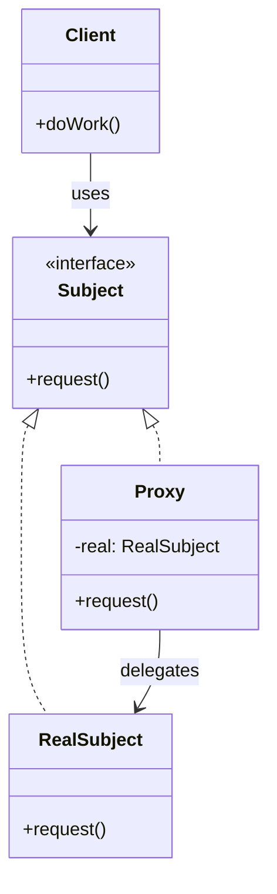

#programming #patterns #structural-patterns

# Proxy Pattern: Controlling Access to an Object

## Definition

The Proxy pattern provides a surrogate or placeholder that controls access to another object. The proxy implements the same interface as the real subject and intercepts calls — adding access control, lazy initialization, logging, caching, or remote communication — before (or instead of) forwarding to the real implementation.

Common variants:

- **Virtual Proxy** — defers creation of an expensive object until it is actually used.
- **Protection Proxy** — checks permissions before delegating.
- **Caching Proxy** — stores results to avoid redundant work.

> [!info] Proxy vs. Decorator
> Both wrap an object behind the same interface, but the intent differs. A Proxy controls *access* to the object (auth, lazy init, caching). A [[Decorator]] adds *new behavior* that composes and stacks. If you are layering multiple concerns, you likely want decorators.

## Diagram



## Example

### Caching Proxy

```rust
use std::collections::HashMap;

trait ImageLoader {
    fn load(&mut self, path: &str) -> Vec<u8>;
}

struct DiskImageLoader;

impl ImageLoader for DiskImageLoader {
    fn load(&mut self, path: &str) -> Vec<u8> {
        println!("Reading from disk: {}", path);
        // Simulate expensive I/O
        path.as_bytes().to_vec()
    }
}

struct CachingProxy {
    inner: DiskImageLoader,
    cache: HashMap<String, Vec<u8>>,
}

impl CachingProxy {
    fn new() -> Self {
        Self {
            inner: DiskImageLoader,
            cache: HashMap::new(),
        }
    }
}

impl ImageLoader for CachingProxy {
    fn load(&mut self, path: &str) -> Vec<u8> {
        if let Some(data) = self.cache.get(path) {
            println!("Cache hit: {}", path);
            return data.clone();
        }

        let data = self.inner.load(path);
        self.cache.insert(path.to_string(), data.clone());
        data
    }
}

fn main() {
    let mut loader = CachingProxy::new();

    loader.load("photo.jpg"); // disk read
    loader.load("photo.jpg"); // cache hit
    loader.load("icon.png");  // disk read
}
```

### Protection Proxy

```rust
trait Database {
    fn query(&self, sql: &str) -> String;
}

struct RealDatabase;

impl Database for RealDatabase {
    fn query(&self, sql: &str) -> String {
        format!("result of: {}", sql)
    }
}

struct AuthProxy {
    inner: RealDatabase,
    role: String,
}

impl Database for AuthProxy {
    fn query(&self, sql: &str) -> String {
        if sql.to_uppercase().starts_with("DROP") && self.role != "admin" {
            return "Access denied: DROP requires admin role".into();
        }
        self.inner.query(sql)
    }
}

fn main() {
    let db = AuthProxy {
        inner: RealDatabase,
        role: "viewer".into(),
    };

    println!("{}", db.query("SELECT * FROM users"));
    println!("{}", db.query("DROP TABLE users"));
}
```

## Trade-offs

### Pros
- Adds behavior (caching, auth, logging) without modifying the real subject.
- Transparent to the client — same interface, different behavior behind the scenes.
- Virtual proxies save resources by deferring expensive initialization.

### Cons
- Adds latency from the extra delegation layer.
- Proxy must stay in sync with the real subject's interface as it evolves.
- Can obscure which implementation is actually handling the call.

> [!tip] Keep Proxies Transparent
> A well-behaved proxy should be a drop-in replacement — same trait, same error types, same observable behavior (minus the added concern). If callers need to know whether they hold a proxy or the real subject, the abstraction is leaking.

## Why It Matters

### When it helps
- You need access control, caching, or lazy loading and the real object should not be responsible for these concerns.
- The real object is remote (network proxy) or expensive to create (virtual proxy).
- You want to instrument calls (logging, metrics) without modifying production code.

### When not to use
- The real subject is cheap to create and has no access restrictions — a proxy is unnecessary overhead.
- You are better served by the [[Decorator]] pattern when the goal is composable behavior stacking rather than access control.
